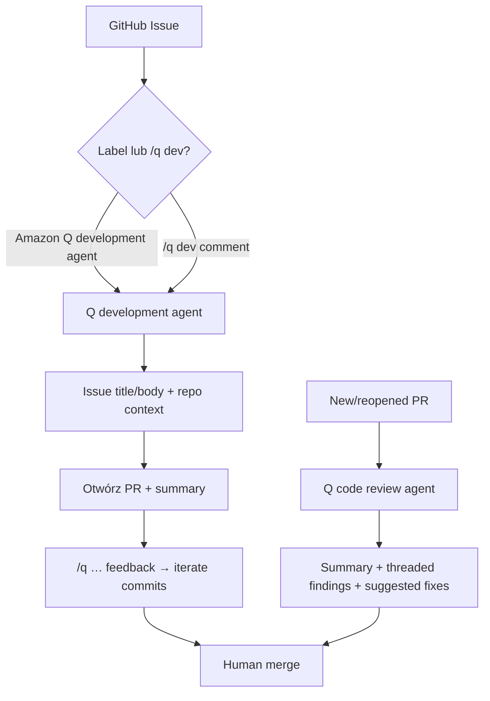

# Amazon Q Developer (GitHub / GitLab)

**Confidence: 86** — klasyczny label klepacz: `Amazon Q development agent` lub `/q dev` → PR; osobny review agent; merge ludzki.

## Co to jest

Integracja AWS w GitHub (i GitLab Duo): issue z etykietą development agent albo komentarz `/q dev` → agent generuje zmiany → otwiera PR + summary. Osobno: Q code review na new/reopened PR. Reguły w `.amazonq/rules/`.

## Graf

## Co / gdzie / jak

| Element | Wartość |
|---------|---------|
| Trigger | Label dokładnie `Amazon Q development agent`; `/q dev`; (transform: osobna etykieta) |
| Sandbox | Backend AWS (nie pełny publiczny VM harness jak Cursor) |
| Rules | Markdown `.amazonq/rules/` dla generate + review |
| Review | Auto na new/reopened PR; **nie** auto na każdym kolejnym commit — `/q review` |
| Merge | Człowiek; branch protection wymaga allowlisty appki Q |
| Iteracja | Natural language comments na PR |
| Nie robi | Durable multi-day orchestrator; auto-merge; cross-platform poza wspieranymi integracjami |

## Linki

- https://docs.aws.amazon.com/amazonq/latest/qdeveloper-ug/amazon-q-for-github.html
- https://docs.aws.amazon.com/amazonq/latest/qdeveloper-ug/github-feature-development.html
- https://docs.aws.amazon.com/amazonq/latest/qdeveloper-ug/github-code-reviews.html
- https://aws.amazon.com/blogs/devops/accelerate-development-workflows-to-reduce-release-cycles-using-the-amazon-q-developer-integration-for-github-preview/
