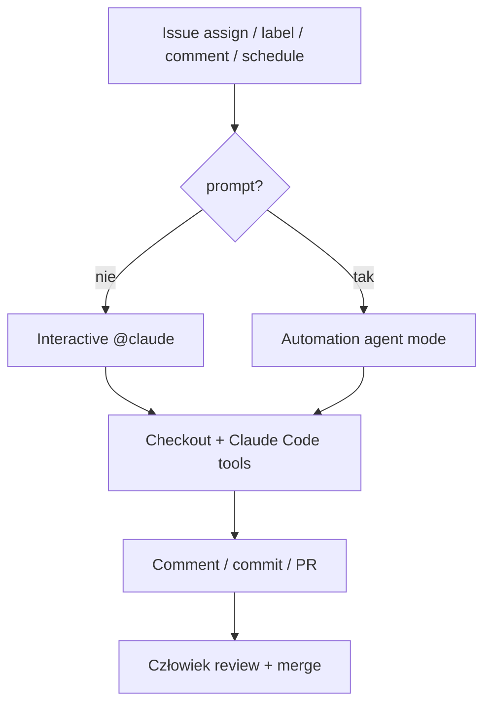

<!-- spine: spine_deterministic -->
# anthropics/claude-code-action

**Confidence: 92** — oficjalny label/automation → branch/PR; budulec klepacza w Actions.

## Co to jest

GitHub Action: interactive `@claude` albo automation `prompt` → edycja, commit, PR. Biega na Twoim runnerze.

## Graf

## Co / gdzie / jak

| Element | Wartość |
|---------|---------|
| Trigger | issues, PR, comments, repository_dispatch, Routines |
| Sandbox | Runner + checkout |
| Merge | Domyślnie ludzki (branch protection) |
| Nie jest | Multi-repo daemon / L5 |

## Linki

- https://github.com/anthropics/claude-code-action
- https://github.com/anthropics/claude-code-action/blob/main/docs/custom-automations.md
