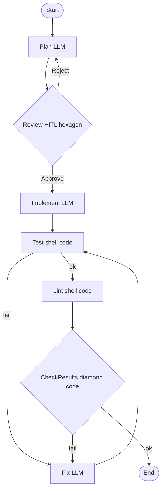

<!-- spine: spine_deterministic -->
# arikWaisman/klaus

**spine: deterministic** — `klaus run` na `.dot`; sprint-plan skill może *wygenerować* DOT, ale runtime = stały graf.

**Confidence: 81** — TS factory: Plan→Review HITL→Implement→Test/Lint shell→Fix loop.

## Co to jest

Klaus = Attractor w TypeScript + Claude Code skills. Pipeline files w `pipelines/*.dot`.

## Graf (FIXED — `plan-and-execute.dot`)

## LLM vs code

| Element | Typ |
|---------|-----|
| klaus runner / diamond / tool_command | **code** |
| Plan / Implement / Fix | **LLM** |
| Review hexagon | HITL |

## Linki

- https://github.com/arikWaisman/klaus
