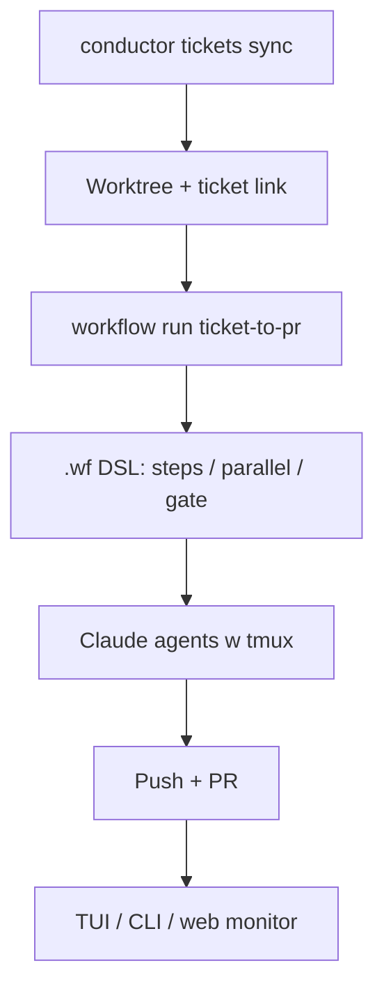

# Conductor (`artushin/conductor-ai` / `devinrosen/conductor-ai`)

Local-first multi-repo orchestrator (Rust + SQLite): worktrees, sync ticketów GitHub/Jira, workflow DSL `.wf`, Claude w tmux. Wbudowany przykład: **`conductor workflow run ticket-to-pr … --input ticket_id=N`**.

## Co / gdzie / jak

| Element | Szczegóły |
|--------|-----------|
| **Trigger** | Ręczne / skrypt: `conductor workflow run ticket-to-pr <repo> <wt> --input ticket_id=…` |
| **Sandbox** | Lokalne worktrees pod `~/.conductor/`; Claude Code w oknach tmux |
| **Agent** | Claude via workflow engine; MCP `conductor mcp serve` (22 tools) |
| **Testy** | Gate steps w `.wf` (human lub automated); structured output + schema validation |
| **Merge** | Człowiek — Conductor robi push/PR lifecycle, nie auto-merge lights-out |

## Confidence: **76 / 100**

Jawny `ticket-to-pr` w CLI = klepacz lokalny. Obniżka: fork artushin ★0 (upstream też niski social proof); nie event-driven GHA — operator odpala workflow.

## Linki

- Repo (fork w fali): https://github.com/artushin/conductor-ai
- Upstream: https://github.com/devinrosen/conductor-ai
- Docs: `docs/architecture/`, `docs/reference/` (DSL `.wf`)
