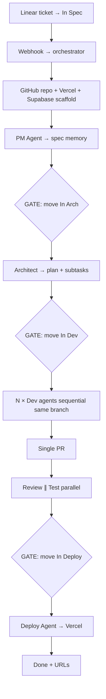

# ashtilawat/minimum-viable-factory

**Repo:** [ashtilawat/minimum-viable-factory](https://github.com/ashtilawat/minimum-viable-factory) · ★40 · Python · LangGraph + Claude Code

## Co to jest

„Ticket in, deployed web app out” — Linear webhook → LangGraph → 6 agentów Claude Code w Docker (PM→Arch→Dev×N→Review∥Test→Deploy) z **trzema human gates** (In Spec / In Arch / In Dev→Deploy). Greenfield Next.js scaffold per ticket; brownfield „next”. Mission Control + memory/*.md.

## Graf

## Co / gdzie / jak

| Warstwa | Mechanizm |
|---------|-----------|
| **Trigger** | Linear status / webhook signature verify |
| **Stan** | LangGraph + append-only `memory/` per ticket; Linear sub-issues |
| **Role** | 6 skills; zero agent-to-agent chat — tylko memory file |
| **Sandbox** | Docker + Claude Agent SDK; 5 MCP (Linear, GH, Vercel, Supabase, Slack) |
| **Testy** | Test Agent + Jest scaffold |
| **Merge/Deploy** | Human gate przed deploy; PR otwierany przed review |

**Uwaga klepacz:** to raczej **greenfield factory** (nowe repo per ticket) niż brownfield bugfix w istniejącym monorepo. Kształt ticket→PR jest, blast radius inny.

## Confidence

**58 / 100** — czytelne ~700 LOC, jasne bramki; greenfield bias + wiele SaaS keys; brownfield zapowiedziany.

## Linki

- https://github.com/ashtilawat/minimum-viable-factory
