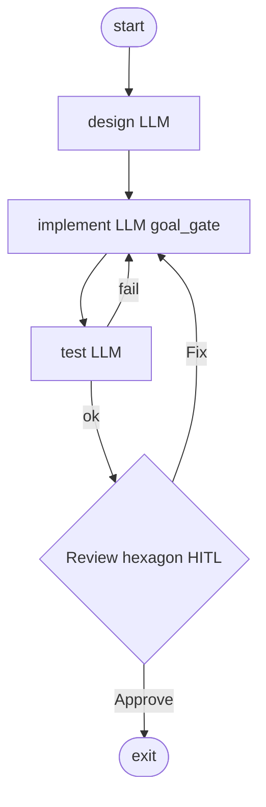

<!-- spine: spine_deterministic -->
# az9713/attractor-software-factory

**spine: deterministic** — `python your_engine.py <blueprint>.dot`; pakiet `attractor/` z `PipelineRunner` + `parse_dot`.

**Confidence: 83** — clone StrongDM + **działający** silnik i ≥5 blueprintów DOT (login, REST API, CLI, landing, data pipeline, SSG). GUIDE.md myląco mówi „no runnable code” — kod jest.

## Co to jest

Software factory: ten sam silnik, różne `.dot` → różne artefakty. CodergenHandler + human review hexagon + retry na fail.

## Graf (FIXED — `build-rest-api.dot`)

## LLM vs code

| Element | Typ |
|---------|-----|
| `your_engine.py` / `PipelineRunner` / validate | **code** |
| box prompts | **LLM** |
| hexagon Review | HITL |
| EventBus progress | **code** |

## Linki

- https://github.com/az9713/attractor-software-factory
- Upstream specs: https://github.com/strongdm/attractor
