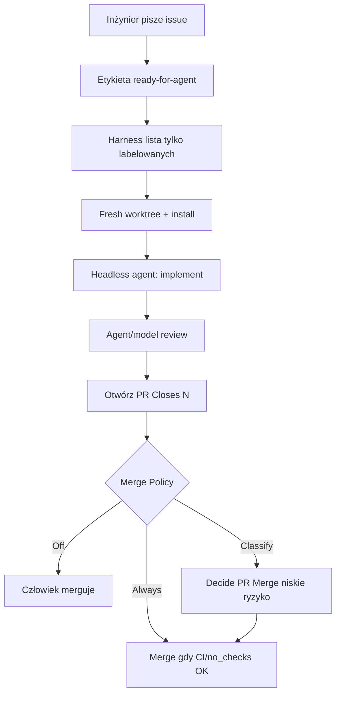

# ready-for-agent

**Confidence: 95** — najbliższy kanonowi KLEPACZ: zdejmuje babysitting issue→merged PR, nie L5.

## Co to jest

Lokalny harness (UI + CLI, npm) wokół GitHub/GitLab issues z etykietą `ready-for-agent`. Ty projektujesz; agent implementuje, reviewuje, otwiera PR i merguje według polityki.

## Graf

## Co / gdzie / jak

| Element | Wartość |
|---------|---------|
| Trigger | Label `ready-for-agent` (domyślnie tylko Twoje autorstwo) |
| Sandbox | Fresh worktree per issue |
| Agent | Claude / Codex / OpenCode / Grok (konfigurowalne) |
| Testy | Build/install w worktree; CI na PR |
| Merge | Off / Classify / Always per repo |
| Nie robi | Backlog, wymyślanie ticketów, architektura produktu |

## Linki

- https://github.com/berenddeboer/ready-for-agent
- https://www.npmjs.com/package/ready-for-agent
- https://github.com/berenddeboer/ready-for-agent/blob/main/CONTEXT.md
