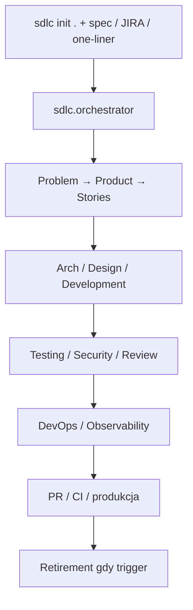

# autonomous-sdlc (`bitbitcodes/autonomous-sdlc`)

Bootstrap **52 agentów** (1 orchestrator + 12 stage + 39 sub) do `.sdlc/` w dowolnym repo: wklejasz spec/JIRA/PRD do `sdlc.orchestrator` → 13 faz z quality gates aż do kodu produkcyjnego (i retirement).

## Co / gdzie / jak

| Element | Szczegóły |
|--------|-----------|
| **Trigger** | IDE chat: wybierz `sdlc.orchestrator` + paste spec; `uvx … sdlc init .` |
| **Sandbox** | Markdown agents w `.sdlc/`; stan w `state/` / `queue/`; 9 IDE z auto-context |
| **Agent** | 52 pliki `.md` — bez runtime framework dependency; harness = Twój IDE agent |
| **Testy** | 13 quality gates + per-phase blind review (docs) |
| **Merge** | Human oversight w modelu; deliverable to kod + CI w repo, nie jeden GHA label mill |

## Confidence: **62 / 100**

Pasuje do briefu `autonomous-sdlc`, ale to **IDE scaffold / agent-count theater risk**: brak natywnego event-driven issue→PR w GHA. Obniżka: orchestracja żyje w chatcie + markdown, nie w deterministycznym runnerze ticketów.

## Linki

- Repo: https://github.com/bitbitcodes/autonomous-sdlc
- Install: `uvx --from git+https://github.com/bitbitcodes/autonomous-sdlc.git sdlc init .`
- Docs: `docs/phases.md`, `docs/quality-gates.md`
