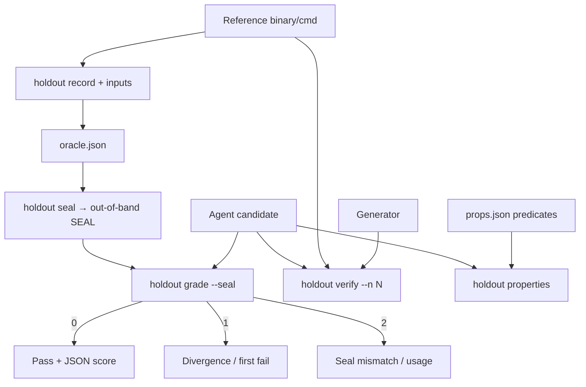

<!-- spine: spine_deterministic -->
# holdout (`brevity1swos/holdout`)

**spine:deterministic** · **Confidence: 84** — agent-facing oracle: differential + held-out + seal; grading = exit codes/JSON, nie LLM-judge.

## Co to jest

Rust CLI: weryfikator dla pętli autonomicznego kodowania. `record` → `seal` → `grade` / `verify` / `properties`. Kandydat nigdy nie powinien widzieć held-out answers (opcjonalnie tylko BLAKE3 hash). Łapie false-green (m.in. real SWE-bench Verified django case + QuixBugs 28/29). Seal musi być out-of-band (`--seal` / `HOLDOUT_SEAL`) — sidecar w workspace da się sfałszować.

## Graf

## Co / gdzie / jak

| Element | Wartość |
|---------|---------|
| Stack | **Rust** · `cargo install holdout` · MIT ★~0 |
| Trigger | Orchestrator w pętli repair / CI gate |
| Orkiestracja | Exit 0/1/2 + JSON; timeout candidate |
| LLM slot | **Brak** w graderze |
| Agent-free | Seal verify, differential, metamorphic, reward scalar |
| Threat model | Seal out-of-band; hash-expected; nie ufać `.seal` w worktree |
| Rola w fabryce | Oracle po Agentless/repair slot — nie sam klepacz |

## Linki

- https://github.com/brevity1swos/holdout
- WAVE3 §8 (holdout / SaifCTL)
- Porównaj: shadow-score-spec (sealed envelope factory-scale)
