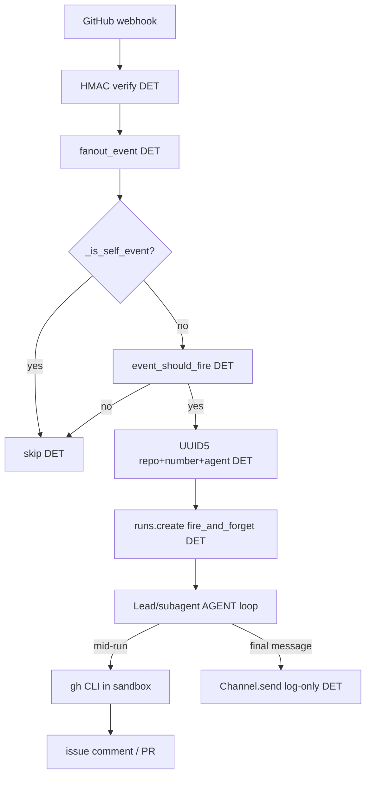

<!-- spine: spine_hybrid -->
# DeerFlow (`bytedance/deer-flow`)

**spine:hybrid** · **Confidence: 84** — kanał GitHub i dispatch są deterministyczne (webhook → fan-out → trigger → UUID5 thread → fire_and_forget); praca kodująca to wolny agent loop w sandboxie (`gh` mid-run). Nie czysty klepacz label→FSM, ale silny pewniaczek na **event intake + outbound bez auto-posta**.

Alias użytkownika: „deerfloor” = **DeerFlow** (Deep Exploration and Efficient Research Flow).

## Co to jest

ByteDance open-source **SuperAgent harness** (LangGraph lead agent + subagents + sandbox + skills + IM gateway). v2 to rewrite; ★80k+. Ticket-to-PR nie jest rdzeniem produktu (to research/coding harness), ale od #3754 GitHub jest **pełnoprawnym kanałem webhookowym**: issue/PR event → agent → `gh pr create` / comment z sandboxa.

## Graf (GitHub channel)

## Co / gdzie / jak

| Element | Wartość |
|---------|---------|
| Stack | **Python 3.12** · LangGraph · FastAPI Gateway · Next.js · sandbox (local/K8s) |
| Trigger | GitHub App webhook: `issues`, `issue_comment`, `pull_request`, reviews; per-agent `github.bindings[].triggers` |
| Orkiestracja (kanał) | **Stała**: HMAC → registry → fan-out → mention/self gates → deterministic thread → fire_and_forget |
| Orkiestracja (praca) | **Agent loop** w harnessie; subagents; recursion_limit wysoki |
| LLM slot | Cały coding/research w lead/subagent |
| Agent-free | Webhook cheap path, UUID5 thread, token mint, self-event gate, follow-up buffer (#4121), log-only outbound |
| Nie robi | Sztywny label FSM merge policy Off/Classify/Always; lokalny test gate przed PR jako osobny DET węzeł |
| Limit | Installation token ~1h; multi-worker follow-up buffer single-process; nie „ciemna fabryka” katalogu |

## Pewniaczki do klepacza (inwestycja)

1. **Webhook tani + `fire_and_forget`** — długi coder nie trzyma HTTP 10s GitHuba ani 300s SDK wait.
2. **Outbound log-only** — cisza = agent nie wywołał `gh`; final message nie spamuje wątku (coder ≠ reviewer na tym samym evencie).
3. **`UUID5(repo, number, agent)`** — osobne thready coder/reviewer; restart/replica bez gubienia kontekstu.
4. **Self-event gate** — własne `gh` comment nie odpala pętli.
5. **Follow-up buffer while busy** — komentarz w trakcie runu nie ginie (cap + drain), zamiast limbo label.
6. **Bindings przy agencie** — `triggers` deklarują eventy; operator kill-switch osobno (`channels.github.enabled`).
7. **Token tylko w sandbox `extra_env`** — installation token per-call, bez bleed do `os.environ`.

Mapowanie na cienki graf (`WORKING_KLEPACZ_GRAPH.md`): intake ≈ webhook/label pick DET; implement/repair ≈ agent SO leaf w sandboxie; review ≈ osobny agent + inny thread_id; merge policy zostaje nasz DET (DeerFlow tego nie ma).

## Linki

- https://github.com/bytedance/deer-flow ★~82k · MIT
- Site: https://deerflow.tech
- GitHub channel RFC: https://github.com/bytedance/deer-flow/issues/3739
- Docs: `backend/docs/GITHUB_AGENTS.md` · commit channel #3754
- Sister: https://github.com/deer-flow/llm-space
