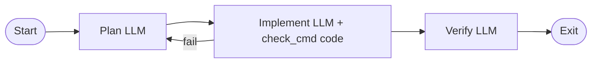

<!-- spine: spine_deterministic -->
# campallison/attractor

**spine: deterministic** — Go: `internal/dot` parser + `internal/pipeline` runner; Docker shell dla tooli.

**Confidence: 86** — pełne 3 warstwy nlspec (LLM client → agent loop → DOT pipeline) z runnable `cmd/run-pipeline`.

## Co to jest

Go implementacja StrongDM Attractor. Deterministyczny traversal start→exit; goal gate, retry, checkpoint, OpenRouter LLM, agent w Dockerze.

## Graf (FIXED — `pipelines/smoke-test.dot`)

## LLM vs code

| Warstwa | Typ |
|---------|-----|
| `internal/dot` + `internal/pipeline` | **code** |
| `check_cmd` / shell tools w Docker | **code** |
| box prompts / agent loop | **LLM** leaf |

## Linki

- https://github.com/campallison/attractor
