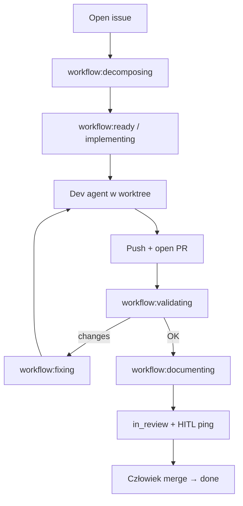

# chippingway/orchestrator (ex `geserdugarov/agent-orchestrator`)

Lokalny orchestrator, który polluje open issues, prowadzi je etykietami `workflow:*`, odpala CLI agentów (Claude/Codex) w izolowanym git worktree, otwiera PR, robi niezależny review pass i pinguje HITL do ręcznego merge. Klepacz ticket→PR ze state machine w samym issue (label + pinned JSON comment).

## Co / gdzie / jak

| Element | Szczegóły |
|--------|-----------|
| **Trigger** | Poll (~60s) open issues + etykiety workflow; start bez osobnego „ready” — decomposer / `DECOMPOSE=off` bierze kolejkę; człowiek może `paused` / `question` |
| **Sandbox** | Lokalny Linux host; izolacja = git worktree; agenci z `--dangerously-skip-permissions` / bypass approvals — host jest granicą |
| **Agent** | Domyślnie Claude (decompose+implement), Codex (review); remap przez `DEV_AGENT` / `REVIEW_AGENT` / `DECOMPOSE_AGENT` |
| **Testy** | Reviewer pass + limity `MAX_ADDED_LINES`, `MAX_CONFLICT_ROUNDS`; oversized wraca do decomposing |
| **Merge** | Wyłącznie ręczne — orchestrator nie merge'uje; jeden ping HITL na gotowy head |

## Confidence: **76 / 100**

Bardzo kompletny state machine + docs + analytics; realny implement→validate→PR loop. Obniżka: nie jest to GitHub Actions label-trigger (local daemon), ~11★, wymaga zalogowanych CLI na hoście i świadomego danger-mode — bliżej self-hosted klepacza niż „drop YAML”.

## Linki

- Repo: https://github.com/chippingway/orchestrator
- Mirror/alias historyczny: https://github.com/geserdugarov/agent-orchestrator
- State machine: `docs/state-machine/` (lifecycle)
- Start: `uv sync --locked` → `./run.sh`
