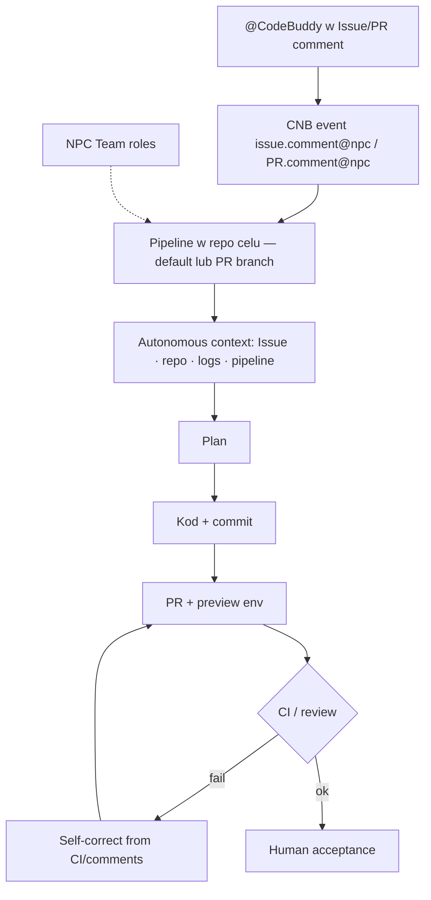

<!-- spine: spine_agent_loop -->
# CodeBuddy NPC (CNB harness) — Chiny · pogłębione

**Produkt:** [CodeBuddy NPC](https://www.codebuddy.cn/npc/) · Tencent Cloud / CNB (`cnb.cool`) · NPC repo [npc/CodeBuddy](https://cnb.cool/npc/CodeBuddy) · docs [NPC](https://docs.cnb.cool/en/build/npc.html)

## Co to jest

Chiński Cloud Agent na CNB: `@CodeBuddy` w Issue/PR → pipeline `issue.comment@npc` / `pull_request.comment@npc` → plan → kod → PR → preview → CI → self-fix. NPC = „AI pracownik w repo”. Multi-NPC Team (dev / review / progress). Work Mode + `CNB_TOKEN` = push/PR. Modele: deepseek-v4, glm-5.x, kimi-k3, hy4. Osobno: CodeBuddy CLI w GitLab CI; `cnbcool/code-review`. **Octop** (TencentCloud/Octop ★1.1k) = self-hosted assistant runtime z ACP do CodeBuddy — **nie** ticket mill (odrzucony wave G).

> Trae SOLO / Qoder Quest = IDE autonomy, nie kolejka ticket→PR. **QoderWake AI Employees** = osobna karta (`../qoder-ai-employees/`). Community `trae-harness` / `QoderAI/better-harness` = ewaluacja, nie mill.

## Graf

## Co / gdzie / jak

| Warstwa | Mechanizm |
|---------|-----------|
| **Trigger** | `@CodeBuddy` / custom NPC; limity: ~100 comment triggers, concurrency cap |
| **Stan** | CNB Issue/PR/pipeline/artefakty („development memory”) |
| **Role** | Built-in CodeBuddy + custom NPCs; team SOPs/Skills |
| **Sandbox** | CNB cloud jobs / GitLab CI container |
| **Testy** | Pipeline + preview; auto-fix build failures |
| **Merge** | Człowiek; NPC nie zastępuje approval |

## Confidence

**68 / 100** — (↑ z 55) oficjalne CNB docs eventów + publiczne npc/CodeBuddy + artykuły 2026-07; nadal brak otwartego orchestratora poza platformą CNB.

## Linki

- https://www.codebuddy.cn/npc/
- https://docs.cnb.cool/en/build/npc.html
- https://cnb.cool/npc/CodeBuddy
- https://developer.cloud.tencent.com/article/2736592
- Octop (nie mill): https://github.com/TencentCloud/Octop
