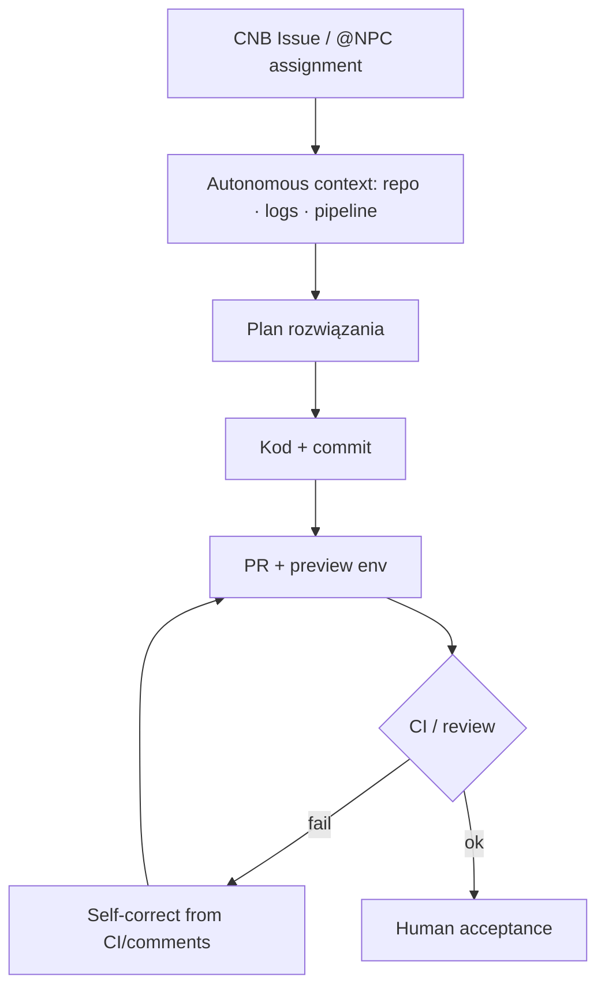

# CodeBuddy NPC (CNB harness) — Chiny

**Produkt:** [CodeBuddy NPC](https://www.codebuddy.cn/npc/) · Tencent Cloud / CNB (`cnb.cool`) · nie czysty publiczny mill-repo

## Co to jest

Chiński Cloud Agent na platformie CNB: ticket/Issue → autonomiczny plan → kod → PR → preview → CI feedback → fix. NPC = „AI pracownik w repo”, nie autocomplete. Multi-NPC team (funkcja / review / progress). Osobno: CodeBuddy CLI w GitLab CI (`@codebuddy` → MR w sandboxie) oraz `cnbcool/code-review` na PR.

> Trae / Qoder: widoczne harnessy community (`trae-harness`, `QoderAI/better-harness`) to **ewaluacja/ulepszanie agent workflow**, nie ticket→PR mill. Do klepacza kwalifikuje się głównie **CodeBuddy NPC + CNB**.

## Graf

## Co / gdzie / jak

| Warstwa | Mechanizm |
|---------|-----------|
| **Trigger** | Przypisanie / @mention NPC na CNB; GitLab: Issue/MR/`@codebuddy` |
| **Stan** | Platforma CNB (Issue, pipeline, artefakty) — zamknięty ekosystem |
| **Role** | Single NPC lub NPC Team (funkcje + review + PM) |
| **Sandbox** | Cloud jobs CNB / GitLab CI container z network/FS limits |
| **Testy** | Pipeline CNB; preview przed merge |
| **Merge** | Człowiek akceptuje; NPC nie zastępuje approval |

Non-US, ticket→PR, ale **vendor lock CNB** — nie da się „forknąć młyna” jak robotsix.

## Confidence

**55 / 100** — silny marketing + artykuły (2026-07 NPC); brak otwartego orchestratora do audytu; kształt klepacza wiarygodny z docs/CI, nie z OSS dogfood.

## Linki

- https://www.codebuddy.cn/npc/
- GitLab CI docs: `@tencent-ai/codebuddy-code` (cdn/jsdelivr docs)
- https://developer.cloud.tencent.com/article/2736592 (CNB AI code review)
- Qoder (nie mill): https://github.com/QoderAI/better-harness
