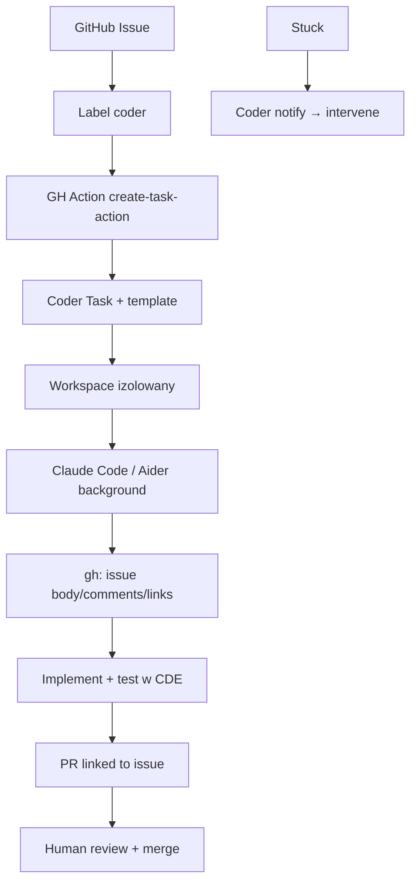

# Coder Tasks (label → workspace agent → PR)

**Confidence: 80** — jasny klepacz `coder` label → Action → Task/Claude Code → PR; self-hosted CDE. Uwaga: Tasks → ESR / zastępowane przez Coder Agents (2026).

## Co to jest

Coder Tasks: joby agentowe w workspace’ach Coder. Wzorzec GitHub: label `coder` → `coder/create-task-action` → Task z Claude Code (background) czyta issue → otwiera PR. Infra = Twoje Coder (sieć, creds, AGENTS.md). Od 2026-06 Tasks na ESR Premium; v2.37+ (2026-09) usuwane z nowych release na rzecz **Coder Agents**.

## Graf

## Co / gdzie / jak

| Element | Wartość |
|---------|---------|
| Trigger | Label `coder` (przykład oficjalny); CLI/API Tasks; IDE Tasks view |
| Sandbox | Pełny Coder workspace (template z ograniczonymi uprawnieniami zalecany) |
| Agent | Claude Code / Aider (moduły template); LLM poza VM |
| Kontekst | Issue URL w promptcie; AGENTS.md; community backlog comments |
| Merge | Ludzki (praktyka wewnętrzna Coder) |
| Automacja | REST API + CLI od ~2.27; GA Tasks ~2.29 (2025-12) |
| Następca | Coder Agents — self-hosted agent loop w control plane; identity użytkownika na PR |
| Nie robi | SaaS „bez infra”; magia bez jasnego issue; auto-merge w demo |

## Linki

- https://coder.com/blog/launch-dec-2025-coder-tasks
- https://github.com/coder/create-task-action
- https://coder.com/docs/ai-coder/tasks
- https://coder.com/docs/ai-coder/agents
- https://coder.com/blog/automate-coder-tasks-via-cli-and-api
