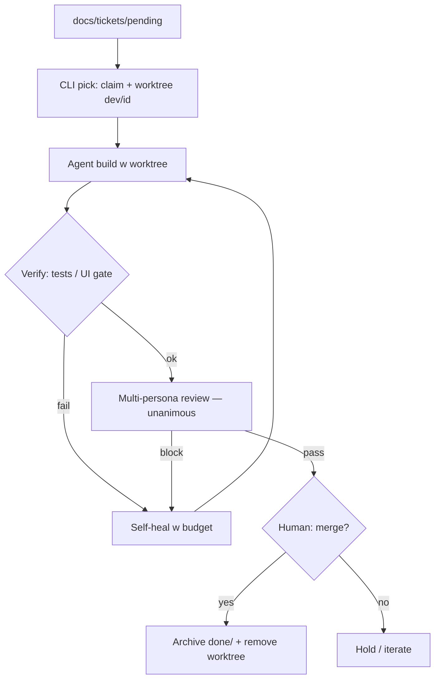

<!-- spine: spine_deterministic -->
# codoop-flow — CN / OSS ticket pipeline

**Repo:** [Codoop/codoop-flow](https://github.com/Codoop/codoop-flow) · ★5 · MIT · README EN+ZH · plugin Codex/Claude/Cursor

## Co to jest

Przenośny młyn lokalny: **ticket → worktree → build → verify → multi-review → (ludzki) merge → archive**. Agent (Codex/Claude) pisze kod; deterministyczny CLI Python (`codoop-execute`) claimuje ticket, zarządza worktree i twardymi bramkami (testy / UI screenshot). Trzy pętle: design produktu → design ticketu → continuous execution. Nie SaaS, nie L5.

## Graf

## Co / gdzie / jak

| Warstwa | Mechanizm |
|---------|-----------|
| **Trigger** | Skill `codoop-execute` / komenda w sesji agenta; kolejka plików ticketów |
| **Stan** | `codoop_flow.toml` + `docs/tickets/{pending,done}` |
| **Role** | Agent implementer + reviewer personas; CLI = guardrail nie-LLM |
| **Sandbox** | `git worktree` na `dev/<ticket_id>` |
| **Testy** | Hard gate w CLI; opcjonalne UI screenshots |
| **Merge** | Agent pyta; człowiek decyduje |

CN-facing (简体中文 README); autor GitHub `Codoop` / Tofu. Wczesny (★5, alpha plugin), ale kształt klepacza kompletny w kodzie.

## Confidence

**72 / 100** — pełny README + CLI/skills w repo; mało stars / brak dużego dogfood publicznego; nie vapor.

## Linki

- https://github.com/Codoop/codoop-flow
- https://github.com/Codoop/codoop-flow/blob/main/README.zh-CN.md
- https://agentmods.dev/plugins/codoop/codoop-flow/codoop-flow
