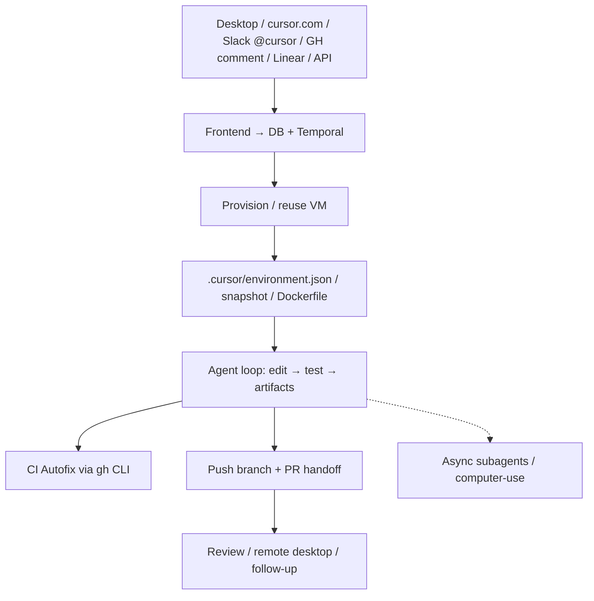

# Cursor Cloud Agents (background as mill)

**Confidence: 85** — równoległe VM→PR; silny mill gdy podpięty Linear/GH/`@cursor`; domyślnie prompt/API, nie czysta etykieta — klepacz z harnessem Temporal, nie L5.

## Co to jest

Cloud Agents Cursor (dawniej Background): frontend tworzy workflow Temporal → izolowana VM → agent loop (edit/test/artifacts) → branch + PR. Wewnętrznie Cursor: >40% PR z cloud agents. Jako mill: kolejka triggerów (Slack, GH comment, Linear, API) zamiast czatu IDE.

## Graf

## Co / gdzie / jak

| Element | Wartość |
|---------|---------|
| Trigger | UI, Slack `@cursor`, GH/Bitbucket comment, Linear, iOS, API — **nie** jedna kanoniczna etykieta |
| Sandbox | Izolowane VM; secrets dashboard; egress allowlist; Self-Hosted Machines |
| Orchestracja | Temporal: agent loop ≠ machine state ≠ conversation stream (retries, hibernacja, multi-day) |
| Testy | Build/test w VM; screenshots/video/logs; hooks format/audit |
| CI Autofix | Agent + `gh` + duże logi jako pliki |
| Merge | Handoff = PR; merge polityką repo / człowiek |
| Multi-repo | Tak (osobne PR); long-running multi-repo ograniczone w docs |
| Lekcja mill | Jakość „cicho” spada bez pełnego env — środowisko = produkt |
| Nie robi | Magiczne env; user hooks z `~/.cursor/hooks.json` na cloud; auto-merge domyślnie |

## Linki

- https://cursor.com/docs/cloud-agent
- https://cursor.com/blog/cloud-agent-lessons (Jun 2026)
- https://www.zenml.io/llmops-database/building-and-operating-agentic-ai-coding-products-at-scale-with-temporal
