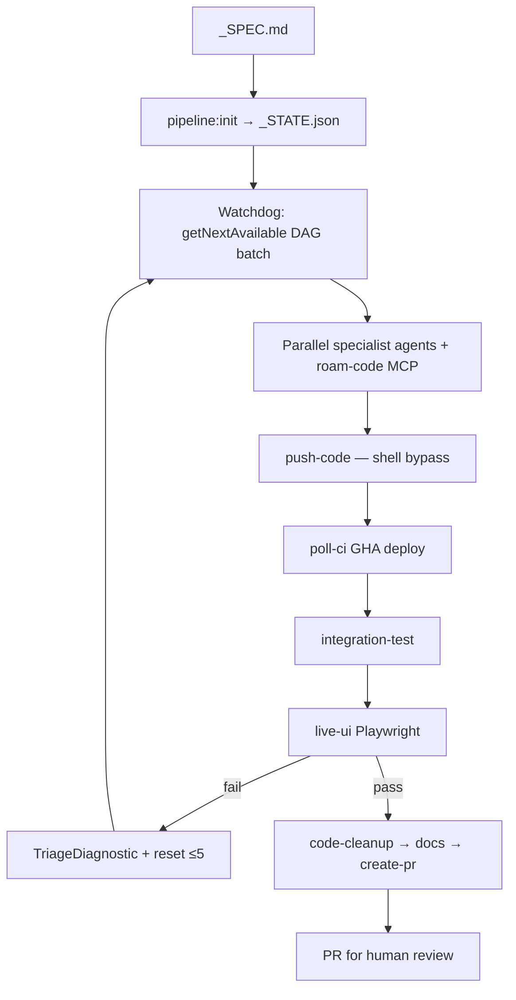

<!-- spine: spine_deterministic -->
# DAGent

**Repo:** [rkaliupin/DAGent](https://github.com/rkaliupin/DAGent) · ★0 · TypeScript · autonomous-factory

## Co to jest

Headless DAG: feature `_SPEC.md` → 12 specjalistycznych agentów (4 fazy) → deploy + Playwright na żywym env → self-heal triage → `create-pr`. Orkiestracja **deterministyczna** (TypeScript while + DAG), LLM tylko w node’ach. Autor świadomie zbieżny ze Stripe Minions. Per-app `.apm/apm.yml` (Microsoft APM).

## Graf

## Co / gdzie / jak

| Warstwa | Mechanizm |
|---------|-----------|
| **Trigger** | Plik spec + `npm run agent:run` (nie label GH — input = spec file) |
| **Stan** | `_STATE.json` + DAG; DevContainer wymagany |
| **Role** | ~12 agentów; push/poll-ci bez LLM; recovery z circuit breakers |
| **Sandbox** | DevContainer + Copilot SDK sessions; constitutional wrappers na git |
| **Testy** | Live backend + Playwright (demo auth); CI/CD **wymagane** |
| **Merge** | Stops at PR — zero human until code review |
| **Portability** | Engine w `tools/autonomous-factory/`; sample = Azure Functions stack |

Klepacz-kształt: spec in → tested PR out. Szerszy niż „jeden bugfix” (full feature + deploy), ale nie marketing L5 discovery.

## Confidence

**68 / 100** — bogata architektura i docs; ★0 + ciężki Azure bootstrap + DevContainer = bariera; dogfood poza sample trudny do zweryfikowania.

## Linki

- https://github.com/rkaliupin/DAGent
- tools/autonomous-factory/docs/00–05
- Stripe Minions (wzorzec referencyjny w README)
