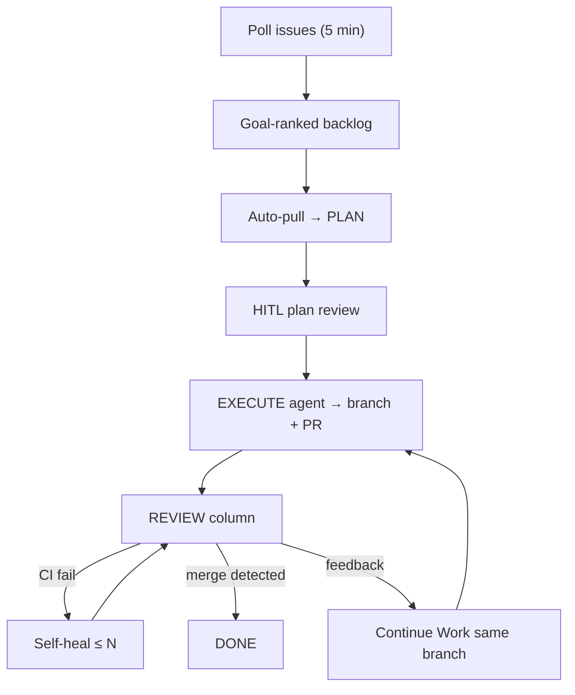

<!-- spine: spine_hybrid -->
# PrismConductor (`darkshade9/prismconductor`)

Desktop (Wails) kanban: agreguje GitHub Issues z wielu workspace → pipeline **TODO → PLAN → IN_PROGRESS → REVIEW → DONE**. Skills `conductor-plan` → `conductor-execute` → `conductor-close`; poller wykrywa PR/CI/konflikty i self-heal.

## Co / gdzie / jak

| Element | Szczegóły |
|--------|-----------|
| **Trigger** | Auto-pull z TODO gdy slot wolny + Goal; plan wymaga człowieka |
| **Sandbox** | Lokalny spawn workerów (Claude / OpenAI / Gemini / Ollama); worktree preserve on failure |
| **Agent** | Pool per role (plan/work/orchestrator); agent-neutral skills |
| **Testy** | Auto-heal na fail CI; conflict badge + rebase worker; duplicate-spawn guard |
| **Merge** | Człowiek na GitHub; poller przenosi kartę po merge (~5 min) |

## Confidence: **68 / 100**

Czysty Conductor-shaped issue→PR z boardem. Obniżka: ★0, brak prebuildów (build from source), remote workers paused — wczesny produkt.

## Linki

- Repo: https://github.com/darkshade9/prismconductor
- Pipeline skills: `conductor-plan` / `conductor-execute` / `conductor-close`
