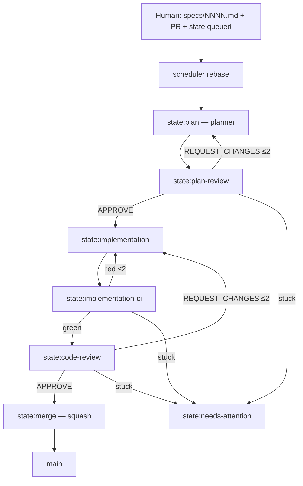

# dmitriy-yefremov/software-factory

**Repo:** [dmitriy-yefremov/software-factory](https://github.com/dmitriy-yefremov/software-factory) · ★0 · JS/TS · fork-and-own template

## Co to jest

Szablon fabryki **spec-first, agent-built, autonomously-merging**: plik `specs/NNNN-*.md` → PR z labelką `state:queued` → maszyna stanów na GitHub Labels napędza 4 agentów Claude (planner → plan-reviewer → implementer → code-reviewer) + ci-gate + auto-merger z guardrails i bounded retries (≤2). Happy path bez człowieka; `state:needs-attention` = park.

## Graf

## Co / gdzie / jak

| Warstwa | Mechanizm |
|---------|-----------|
| **Trigger** | Label `state:queued` na PR ze specem |
| **Stan** | Atomowy label-swap (`.github/scripts` + `pipeline-scripts`) |
| **Role** | 4 briefs w `.claude/agents/` + 9 GHA workflows |
| **Sandbox** | GitHub Actions + Claude; lokalne slash `/plan` `/implement` |
| **Testy** | `ci-gate` routuje po wyniku CI |
| **Merge** | auto-merger: rebase + guardrails + squash |
| **Setup** | 2 GitHub Apps, secrets, `init-factory.mjs` stamp |

Prawie 1:1 z etykietą `ready-for-agent` z KLEPACZ.md — tu FSM jest bogatszy (plan review przed kodem).

## Confidence

**72 / 100** — kompletny silnik w repo, ★0 = ultra-obscure; brak publicznej telemetrii dogfood poza README (ryzyko „ładny template”).

## Linki

- https://github.com/dmitriy-yefremov/software-factory
- docs/agent-pipeline.md, docs/SETUP.md w repo
