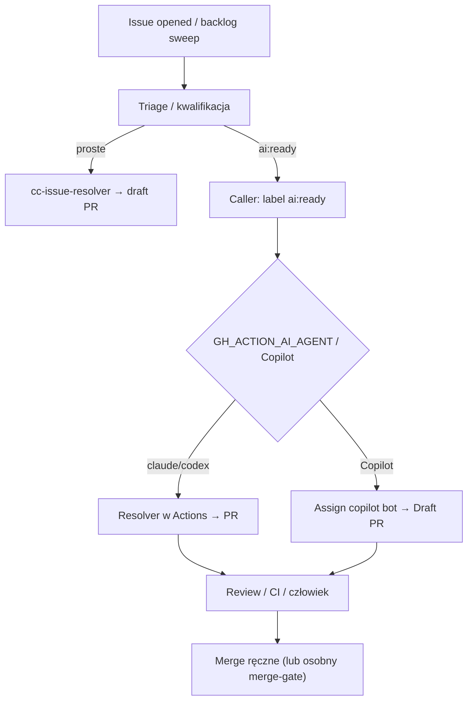

<!-- spine: spine_deterministic -->
# dryvist/ai-workflows (+ wzorzec `ai:ready`)

Biblioteka reusable GitHub Actions (`workflow_call`) do AI-ops: triage, sweeper, CI-fix, a w ścieżce klepacza — `cc-issue-resolver` oraz konsumenci z etykietą **`ai:ready`**, którzy odpalaają Claude/Codex albo przypisują Copilot Coding Agent. To nie L5 fabryka produktu, tylko importowalne mrówki ticket→PR / ticket→fix.

## Co / gdzie / jak

| Element | Szczegóły |
|--------|-----------|
| **Trigger** | `issues: [opened]` dla `cc-issue-resolver`; u konsumentów `issues: labeled` gdy `ai:ready` (np. `tofu-proxmox`, `nix-ai`); opcjonalnie weekly `issue-backlog-sweep` nakłada `ai:ready` |
| **Sandbox** | GitHub-hosted runners; adapter `run-ai-agent` (Claude lub Codex wg `GH_ACTION_AI_AGENT`) |
| **Agent** | Claude (`GH_ACTION_AI_API_KEY`) lub Codex (`OPENAI_API_KEY`); warianty Copilot assign w `dryvist/ai-assistant-instructions` (`ai:ready` → `ai:assigned`) |
| **Testy** | Osobne workflowy: `cc-ci-fix`, `cc-post-merge-tests`, limity dzienne dispatch; resolver zakłada dobrze scoped issue |
| **Merge** | Domyślnie człowiek / draft PR; jest też `_ai-merge-gate.yml` jako opcjonalny gate, nie lights-out |

## Confidence: **80 / 100**

Silny sygnał: wiele dogfood-repo dryvist z tym samym kontraktem `ai:ready`, reusable YAML, dokumentacja auth i katalog promptów. Obniżka: to suite wielu workflowów (nie jeden „godark”), a ścieżka ticket→PR jest jedną z funkcji obok hygiene/CI — trzeba świadomie podłączyć caller z label triggerem.

## Linki

- Repo: https://github.com/dryvist/ai-workflows
- Resolver: `.github/workflows/cc-issue-resolver.yml`
- Sweep → `ai:ready`: `.github/workflows/issue-backlog-sweep.yml`
- Przykład callera `ai:ready`: https://github.com/dryvist/tofu-proxmox/blob/develop/.github/workflows/issue-auto-resolve.yml
- Copilot assign na `ai:ready`: https://github.com/dryvist/ai-assistant-instructions/blob/main/.github/workflows/copilot-issue-resolve.yml
