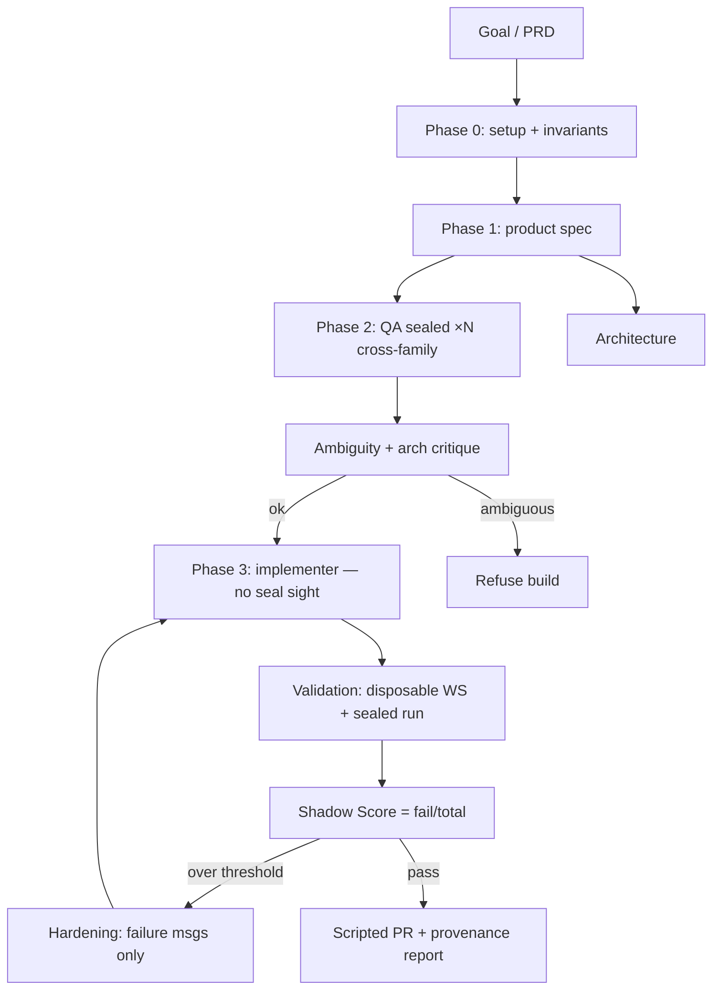

<!-- spine: spine_deterministic -->
# Dark Factory (`DUBSOpenHub/dark-factory`)

**spine:deterministic** · **Confidence: 88** — fazy 0→PR ustalone; grading = sealed-envelope + Shadow Score (exit codes); cross-family invariant w CI; builder nie widzi suite.

## Co to jest

Copilot CLI skill: free-text goal → disposable worktree → 8 specjalistów z **różnych family modeli** → production PR. Sealed tests pisane *przed* kodem, chowane poza repo; score = sealed_failures / sealed_total. Spec ambiguity gate gdy dwie niezależne sealed suite się sprzeczają. Implementacja Shadow Score Spec v2 L4.

## Graf

## Co / gdzie / jak

| Element | Wartość |
|---------|---------|
| Stack | **TypeScript / Markdown skills** · Copilot CLI · MIT ★~25 |
| Trigger | `/skills` + goal text (nie czysta etykieta GH) |
| Orkiestracja | Stałe fazy + vault hash; CI sprawdza model-independence |
| LLM slot | Spec, seal authors, implementer, red team (różne family) |
| Agent-free | Hash/vault, score, fail threshold, provenance, refuse-on-ambiguity |
| Oracle | [shadow-score-spec](https://github.com/DUBSOpenHub/shadow-score-spec) |
| Nie robi | Builder widzi sealed; seal==implementer family (forbidden) |

## Linki

- https://github.com/DUBSOpenHub/dark-factory
- Spec: https://github.com/DUBSOpenHub/shadow-score-spec
- Site: https://dubsopenhub.github.io/dark-factory/
- WAVE3 §8
