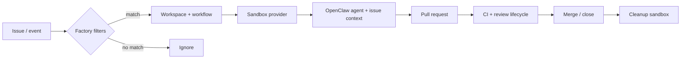

# elasticclaw

**Repo:** [elasticclaw/elasticclaw](https://github.com/elasticclaw/elasticclaw) · ★40 · Go · Apache-2.0 · docs: elasticclaw.ai

## Co to jest

Control plane dla dark software factories: event z trackera (Linear / GitHub Issues / Shortcut / webhook) → filtr workflow → workspace → sandbox (Daytona / CMX / exe.dev) → agent OpenClaw ze scoped GitHub App creds → PR → CI/review → cleanup. Nie jest coding agentem — jest orkiestracją wokół agentów.

## Graf

## Co / gdzie / jak

| Warstwa | Mechanizm |
|---------|-----------|
| **Trigger** | Linear `status_changed` / labels / team / project; GH Issues; Shortcut; webhooks |
| **Stan** | ElasticClaw Server (single binary Go): API, UI, lifecycle state |
| **Role** | Workflow stages (konfigurowalne); opcjonalny plan-approval gate (schema, nie chat) |
| **Sandbox** | Daytona, Replicated CMX, exe.dev — ephemeral VM |
| **Creds** | GitHub App → tymczasowe installation tokens per agent (nie szeroki PAT) |
| **Testy / CI** | Watch review + CI; lifecycle policy w workflow YAML |
| **Cleanup** | Po merge/close — tear-down workspace |

Klepacz w sensie KLEPACZ.md: kolejka trackera → izolowana sesja → PR. Ludzie definiują workspace/workflow, nie klepią diffów.

## Confidence

**78 / 100** — jasny issue→PR loop, docs + brew install + przykłady YAML; early OSS (★40), zależny od OpenClaw + sandbox providera.

## Linki

- https://github.com/elasticclaw/elasticclaw
- https://elasticclaw.ai/docs
- [examples/workflows/linear-issue.yaml](https://github.com/elasticclaw/elasticclaw/blob/master/examples/workflows/linear-issue.yaml)
- [plan approval](https://elasticclaw.ai/docs/workflows#plan-approval)
