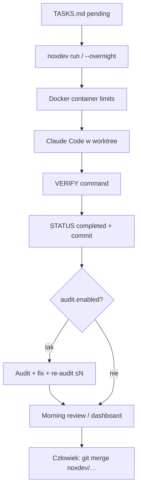

# eugeneorlov/noxdev (`@eugene218/noxdev`)

**Confidence: 80** — overnight Node CLI: TASKS.md → Docker + worktree + Claude Code → commit → morning review/dashboard; nie label-GitHub, ale lokalny harness ticket→diff.

## Co to jest

OSS CLI (Node ≥24) do autonomicznej pracy nocnej. Specyfikujesz taski w `TASKS.md` (STATUS/FILES/VERIFY/SPEC), `noxdev run` odpala Claude Code w kontenerze Docker na izolowanym worktree, po `COMPLETED` opcjonalny **audit-fix loop**, rano `noxdev status` / dashboard do review i ręcznego merge.

## Graf

## Co / gdzie / jak

| Element | Wartość |
|---------|---------|
| Stack | **Node.js** CLI + React dashboard; npm `@eugene218/noxdev` |
| Trigger | Plik `TASKS.md` (nie GitHub label) — lokalna kolejka tasków |
| Sandbox | Docker containment + git worktree; main nietknięty |
| Agent | Claude Code w kontenerze; audit na mocniejszym modelu |
| Testy | Pole `VERIFY` per task + opcjonalny audit-fix |
| Merge | Świadomie ręczny poranny merge |
| Safety | Circuit breaker (3 fail → pause), cost tracking |
| Nie robi | Native poll GitHub Issues (to TASKS.md mill, nie label-daemon) |

## Linki

- https://github.com/eugeneorlov/noxdev
- npm: https://www.npmjs.com/package/@eugene218/noxdev
