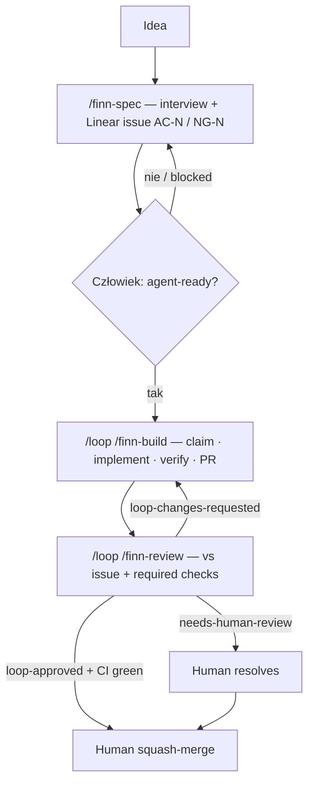

<!-- spine: spine_agent_loop -->
# Finn-loop

**Repo:** [finna/Finn-loop](https://github.com/finna/Finn-loop) · ★306 · JS (Claude Code skills) · MIT

## Co to jest

Trzy skille Claude Code (`/finn-spec`, `/finn-build`, `/finn-review`) + jedna etykieta `agent-ready` w Linear. Reguła twarda: **humans merge**. Minimalny, uczciwy klepacz: idea → wywiad → Linear issue z AC/NG → człowiek klei `agent-ready` → builder bierze issue i otwiera PR → reviewer wiesza `loop-approved` / `needs-human-review` → człowiek merguje.

## Graf

## Co / gdzie / jak

| Warstwa | Mechanizm |
|---------|-----------|
| **Trigger** | Tylko człowiek stawia `agent-ready` (agent nigdy sam) |
| **Stan** | Linear (kolejka) + GitHub labels (`loop-approved`, …) — bez shadow state w Slacku |
| **Role** | spec / build / review — osobne sesje; builder nie reviewuje siebie |
| **Sandbox** | Worktree + `gh`; `/loop` wymaga otwartej sesji Claude Code ≥2.1.71 |
| **Testy** | Required status checks target repo (Finn nie tworzy CI) |
| **Merge** | Agents **never** merge; `loop-approved` = dowód, nie pozwolenie |
| **Rozszerzenia** | README opisuje Slack control plane, risk-aware merge, watchdog — *nie* w starterze |

Kanoniczny przykład wąskiej mrówki z KLEPACZ.md (label = weź).

## Confidence

**85 / 100** — precyzyjna polityka, zgodna z klepaczem; ★306 wyżej niż „obscure”, ale to wciąż skill-pack, nie SaaS; zależny od `/loop` i Linear connector.

## Linki

- https://github.com/finna/Finn-loop
- skills/finn-build, finn-review, finn-spec w repo
