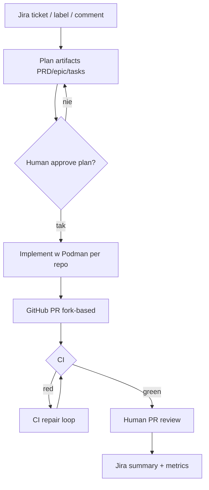

# Forge SDLC

**Repo:** [forge-sdlc/forge](https://github.com/forge-sdlc/forge) · ★20 · Python 3.11+ · MIT · LangGraph / Deep Agents

## Co to jest

Event-driven **forge mill**: Jira ticket → (human-gated plan) → implementacja w efemerycznych kontenerach Podman → GitHub PR → CI repair → human review → update Jira. Workflow-first (nie „jeden duży prompt”). Cross-repo planowanie, approval gates, audit.

## Graf

## Co / gdzie / jak

| Warstwa | Mechanizm |
|---------|-----------|
| **Trigger** | Webhooks Jira/GitHub; labels/comments |
| **Stan** | LangGraph workflow checkpoints + journal efektów zewnętrznych |
| **Role** | Typed stations (plan / impl / CI / review) — agent nie routuje sam |
| **Sandbox** | Ephemeral Podman, scoped repo access |
| **Testy** | Repo CI jako wyrocznia + auto-repair |
| **Merge** | Zawsze human PR review przed merge |
| **Obs** | Prometheus / Langfuse / Grafana |

Grubszy niż wąski klepacz (planowanie + cross-repo), ale ten sam łańcuch ticket→PR z HITL.

## Confidence

**75 / 100** — klarowny ticket→PR + CI repair; ★20; cięższy stack niż lokalny bash mill; bliżej L3.5 delivery niż samej mrówki.

## Linki

- https://github.com/forge-sdlc/forge
- https://Forge-sdlc.github.io/forge/ (docs)
