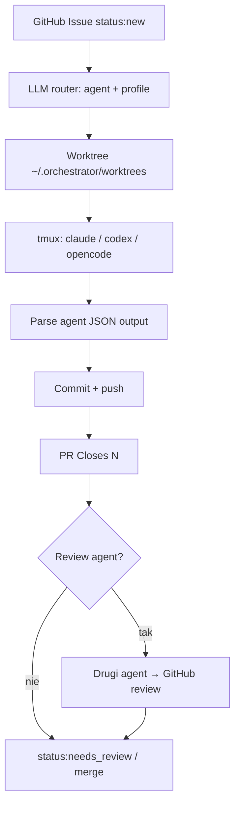

<!-- spine: spine_hybrid -->
# gabrielkoerich/orchestrator

**Confidence: 87** — lokalny CLI/daemon (brew): GitHub Issue labels = stan; LLM router → worktree + tmux (claude/codex/opencode) → commit/PR `Closes #N`.

## Co to jest

Lekki autonomiczny orchestrator: zadania = GitHub Issues. Polluje `status:new`, router LLM wybiera agenta/model, tworzy izolowany worktree, odpala agenta w sesji tmux, zbiera JSON wynik, commit/push i otwiera PR. Opcjonalny agent-reviewer. Stan w labelach + sidecar JSON w `~/.orchestrator/`.

## Graf

## Co / gdzie / jak

| Element | Wartość |
|---------|---------|
| Stack | Shell + Python helpers; Homebrew formula; Just/yq/jq |
| Install | `brew tap gabrielkoerich/tap && brew install orchestrator` |
| Trigger | Label `status:new` (lub `orchestrator task add` / `orchestrator start` poll) |
| Sandbox | Bare clone + worktree per task; agent w tmux z pełnymi toolami |
| Agent | `claude`, `codex`, `opencode` (label `agent:*`) |
| Role | Labels: complexity, role:backend/frontend/docs, plan, no-agent |
| PR | Automatyczny; powiązanie `Closes #N` |
| Nie robi | Cloud control-plane — wszystko lokalnie w `~/.orchestrator/` |

## Linki

- https://github.com/gabrielkoerich/orchestrator
- (mirror/opis wcześniej jako orchestrator-sh)
