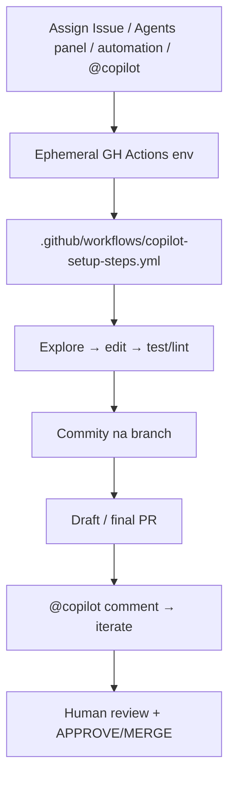

# GitHub Copilot coding / cloud agent

**Confidence: 88** — assign/label/automation → ephemeral Actions env → draft PR; agent nie merguje; kanoniczny klepacz BigCo.

## Co to jest

Asynchroniczny agent GitHub/Microsoft: issue przypisany do Copilot (panel Agents, automations, Slack/Teams, `@copilot`) → środowisko na Actions → branch + draft PR. Limit 59 min / jedno repo / jeden PR na task.

## Graf

## Co / gdzie / jak

| Element | Wartość |
|---------|---------|
| Trigger | Assign to Copilot; Agents; automations (schedule / on issue); `@copilot`; Slack/Teams; security campaigns |
| Sandbox | GitHub Actions-powered ephemeral env; custom runners + MCP (GitHub, Playwright) |
| Instrukcje | Custom instructions, Memory, Skills, Hooks (`preToolUse` / `postToolUse` / `agentStop`) |
| Testy | W Actions env; Copilot code review osobna powierzchnia |
| Merge | Agent **nie** merguje; rulesets / branch protection |
| Limity | Max 59 min; 1 repo; 1 branch/PR; tylko hosty GitHub |
| Custom agents | Specjalizacje (frontend/docs/testing) — nie swarm w jednym runie |
| Nie robi | Cross-repo w jednym runie, merge/deploy, sesje >59m |

## Linki

- https://docs.github.com/en/copilot/concepts/agents/cloud-agent/about-cloud-agent.md
- https://github.blog/ai-and-ml/github-copilot/github-copilot-coding-agent-101-getting-started-with-agentic-workflows-on-github/
- https://docs.github.com/en/copilot/responsible-use/copilot-coding-agent
