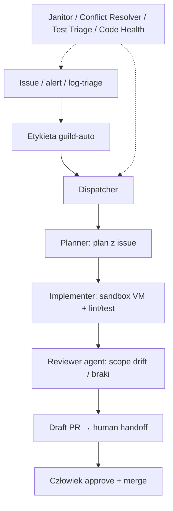

<!-- spine: spine_deterministic -->
# Guild Software Factory

**Confidence: 90** — komercyjny klepacz (plan→implement→review→handoff), jawny brak auto-merge; metryki własne vendora, nie L5.

## Co to jest

Produktowy młyn na Guild: etykieta `guild-auto` na issue (GitHub/GitLab/Jira) odpala wąskich agentów (dispatcher → planner → implementer w sandboxie → reviewer). Człowiek merguje. Osobni janitorzy utrzymują kolejkę.

## Graf

## Co / gdzie / jak

| Element | Wartość |
|---------|---------|
| Trigger | Label `guild-auto` (pełny pipeline lub osobne etapy); eventy GH/GL/Jira; inne agenty tworzą issue |
| Sandbox | Izolowana VM; Guild mediuję dostęp do repo; Claude Code w implementacji (model-agnostic platforma) |
| Role | Planner ≠ Implementer ≠ Reviewer; plus Conflict Resolver, Janitor, Code Health, Test Triage |
| Testy | Lintery/typy/testy repo w sandboxie przed draft PR |
| Merge | **Nigdy** auto — „Agents do the work. People own the outcome.” |
| Skills | Konwencje repo, komendy testów, DoD — oddzielone od ogólnego workflow |
| Metryki (vendor, Guild) | ~34% merged PR z Factory; 75% acceptance; 91% bez commitów inżyniera; ~$12/merged PR |
| Nie robi | Strategia produktu, duże niejednoznaczne feature’y, merge |

## Linki

- https://www.guild.ai/product/software-factory
- https://www.guild.ai/blog/product/introducing-guild-software-factory (2026-09-03)
- https://docs.guild.ai/platform/smith (`blueprint_software_factory`)
