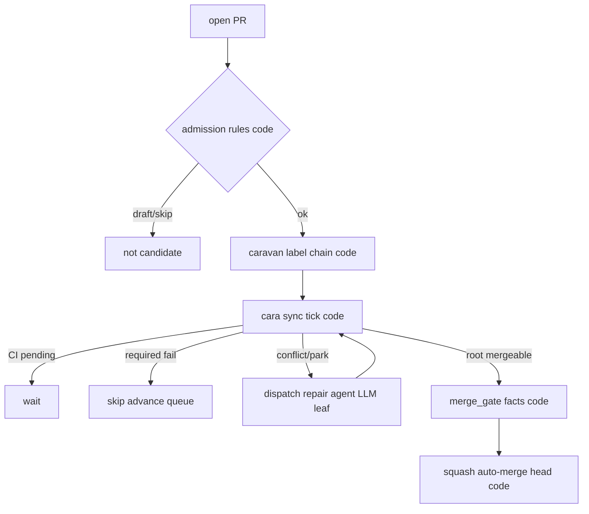

<!-- spine: spine_deterministic -->
# harryaskham/caravan (`cara`)

**spine: deterministic** — merge queue jako typed decision tree w Rust; agent wzywany tylko na typed repair, nie prowadzi kolejki.

**Confidence: 76** — „Fleet decisions never depend on your checkout”; `merge_gate` w kodzie; LLM = leaf na konflikt/repair.

## Co to jest

Agent-in-the-loop merge queue dla GitHub PR (labelled chains). `cara sync` idempotentny: CI wait / skip red / park / repair-route — orkiestracja = SPEC.md + Rust, nie chat.

## Graf (FIXED — lifecycle admission→merge)

## LLM vs code

| Element | Typ |
|---------|-----|
| admission / scheduler_status / SHA receipts | **code** |
| `merge_gate` / RootMergeFacts | **code** |
| repair when typed refusal needs semantics | **LLM** leaf |

## Linki

- https://github.com/harryaskham/caravan
- Site: https://a.skh.am/caravan/
