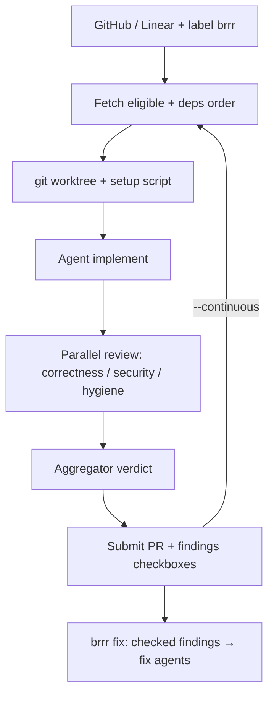

<!-- spine: spine_agent_loop -->
# hsubra89/brrr

**Confidence: 84** — Rust CLI „ralph loop”: label (GH/Linear) → worktree → choose/implement/review → PR; agent-agnostic (Claude/Codex/OpenCode).

## Co to jest

`brrr` to lokalny CLI w Rust implementujący **ralph loop**: pobiera taski z trackera (GitHub Issues / Linear) po etykiecie (domyślnie `brrr`), robi izolowany worktree, orkiestruje fazy choose → implement → multi-phase self-review, pushuje branch i otwiera PR z checklistą findings. Tryb `--once` albo `--continuous`.

## Graf

## Co / gdzie / jak

| Element | Wartość |
|---------|---------|
| Stack | **Rust** (`cargo install` / install.sh); config `.brrr/config.toml` |
| Trigger | Label `brrr` (konfigurowalne); continuous poll |
| Sandbox | Worktree poza main (`worktree_dir`); opcjonalny `worktree-setup.sh` |
| Agent | Claude / Codex / OpenCode (trait runner) |
| Review | Wielofazowy równoległy + aggregator; `brrr review` / `brrr fix` na istniejące PR |
| PR | Submission backend GitHub |
| Nie robi | Cloud SaaS; to lokalny loop jak Huntley/Pocock ralph |

## Linki

- https://github.com/hsubra89/brrr
- Inspiracje: lalph, accountability, mattpocock/skills, ghuntley.com/loop
