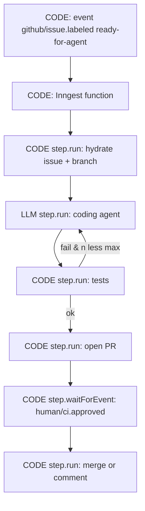

<!-- spine: spine_deterministic -->
# Inngest — event-driven step functions jako spine

**spine:deterministic**  
**Confidence: 84** — durable steps (`step.run` / `step.waitForEvent`) = granice trwałości; popularny wybór TS/Python na event→agent→PR; routing i fan-out w kodzie funkcji, nie w LLM.

## Co to jest

**Inngest** modeluje klepacza jako **funkcję sterowaną eventem** (`github/issue.labeled`). Każdy `step.run("implement", …)` / `step.run("tests", …)` jest checkpointem: retry dotyczy tylko padniętego kroku; `step.waitForEvent` = HITL (np. `pr/approved`). Orkiestracja to zwykły TypeScript/Python z jawnymi krokami — LLM siedzi *wewnątrz* wybranego stepu, nie decyduje o grafie.

## Graf

## LLM vs code (węzły)

| Węzeł | Typ | Uwaga |
|-------|-----|--------|
| Function control flow, fan-out, sleeps, waitForEvent | **CODE** | Event history / step memoization |
| hydrate, tests, `gh`, merge | **CODE** `step.run` | Idempotent keys |
| coding agent / summary comment | **LLM** `step.run` | Jedyny płatny slot |
| „czy mergować?” | **CODE** + event | Nie LLM judge jako jedyna bramka |

## Co / gdzie / jak

| Element | Wartość |
|---------|---------|
| Trigger | Inngest event (GitHub webhook relay, cron, custom) |
| Spine | Inngest Cloud lub self-host dev server |
| Agent leaf | Claude/Codex SDK w jednym stepie z timeoutem |
| HITL | `step.waitForEvent` / invoke another function |
| Fit | Event-reactive pipelines; mniej naturalne na 2h linear agent loop → rozważ Trigger.dev |

## Linki

- https://www.inngest.com/docs/agents
- https://www.inngest.com/docs/features/inngest-functions/steps-workflows
- Porównanie 2026: https://tanayshah.dev/blog/trigger-vs-inngest-vs-temporal-agents/
