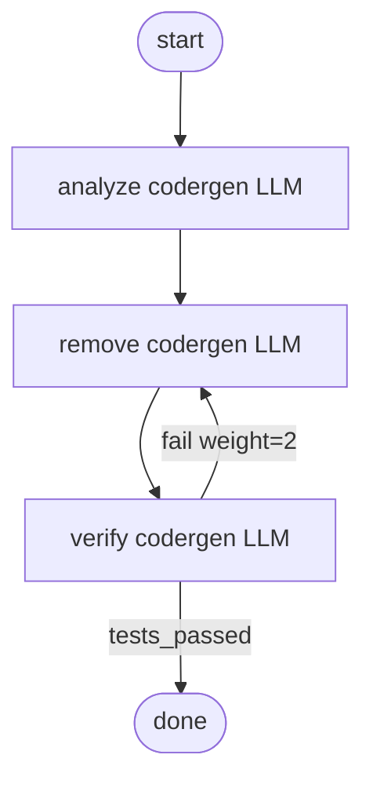

<!-- spine: spine_deterministic -->
# jawhnycooke/attractor

**spine: deterministic** — `attractor run refactor.dot`; codergen handler jako leaf w węzłach DAG.

**Confidence: 80** — Python CLI; conditions `tests_passed` routują fix-loop bez LLM-orchestratora.

## Co to jest

Non-interactive coding agent for software factories. DOT DAG → handlery (głównie codergen).

## Graf (FIXED — README refactor)

## LLM vs code

| Element | Typ |
|---------|-----|
| graph walk / conditions | **code** |
| type=codergen nodes | **LLM** leaf |

## Linki

- https://github.com/jawhnycooke/attractor
