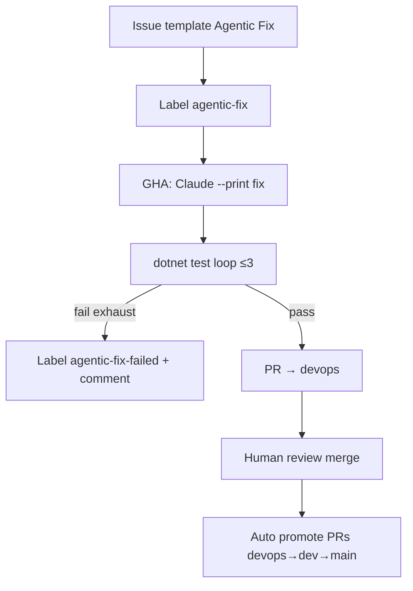

<!-- spine: spine_deterministic -->
# JBS Agentic DevOps (`agentic-fix` label)

Wzorzec z **JBS Tech Blog** (日本ビジネスシステムズ): Issue + etykieta **`agentic-fix`** → GHA + Claude Code (Microsoft Foundry) → fix + testy → retry ≤3 → PR do `devops`, potem promocja `devops → dev → main` z HITL na każdym stopniu.

## Co / gdzie / jak

| Element | Szczegóły |
|--------|-----------|
| **Trigger** | `issues: labeled` gdy `agentic-fix`; issue template wymusza repro/expected/actual |
| **Sandbox** | GitHub Actions; Claude Code `--dangerously-skip-permissions`; billing via Azure Foundry |
| **Agent** | Claude Code; prompty `initial-fix.md` / `retry-fix.md` / `summarize-pr.md` |
| **Testy** | `dotnet test` w pętli; retry dostaje diff + fail log + strategię |
| **Merge** | Człowiek na każdym stopniu branch promotion (3-stage) |

## Confidence: **58 / 100**

Textbook label→PR (focus `agentic-fix` / JBS), z guardrailami retry i failed label. Obniżka: **brak publicznego OSS repo** — tylko artykuł blogowy + TodoApp dogfood wewnętrzny; nie da się forknąć YAML 1:1.

## Linki

- Blog: https://blog.jbs.co.jp/entry/2026/07/24/140419
- Kontekst org: JBS AI Agent Factory (szerszy, Microsoft Agents 365) — nie ten mill
