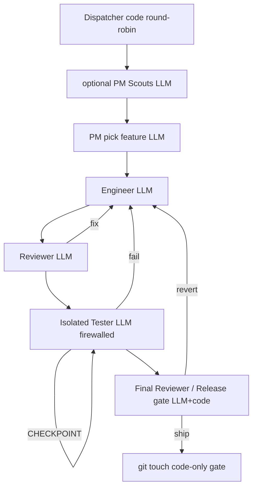

<!-- spine: spine_deterministic -->
# jeffma8888/agent-foundry

**spine: deterministic** — `dispatcher.py` + `foundry.py` + `foundry.config.json`: round-robin work_items; stały core PM→Engineer→Reviewer→Tester→Release gate.

**Confidence: 78** — nie DOT→GHA, ale foundry.config + stałe stage’y w kodzie; reward = artefakt + zielone testy (gate re-run), nie self-report LLM.

## Co to jest

Always-on product org harness. Dispatcher (single brain) nie dzieli token budget. Release gate jedyny z gitem. Bench ról triggowanych, nie zawsze-on.

## Graf (FIXED — per-iteration core)

## LLM vs code

| Element | Typ |
|---------|-----|
| dispatcher / stage success = file exists + suite green | **code** |
| weak-tests / novelty-check detectors | **code** |
| role-cards (PM, eng, reviewer, tester) | **LLM** leaf |
| release gate re-run ground truth | **code** + LLM verdict |

## Linki

- https://github.com/jeffma8888/agent-foundry
- `foundry.config.example.json` w root
