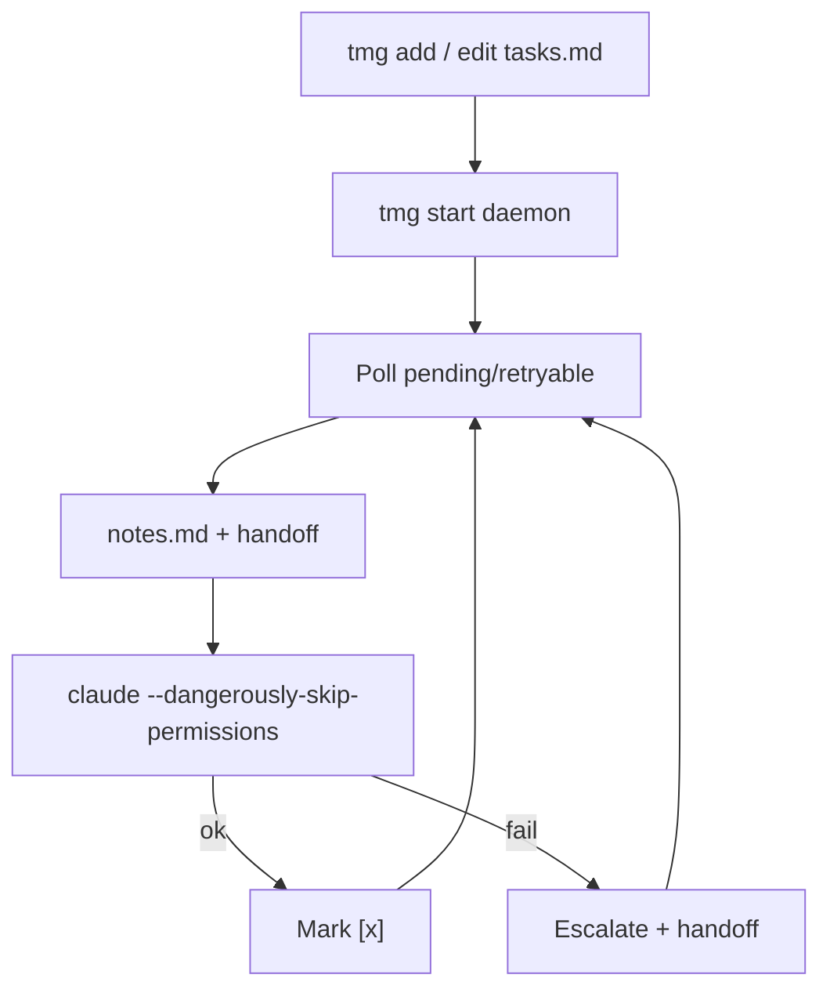

<!-- spine: spine_agent_loop -->
# Trismegistus (`tmg`)

**Repo:** [jessekaff/trismegistus](https://github.com/jessekaff/trismegistus) · ★0 · TypeScript · MIT · CLI `tmg`

## Co to jest

Lokalny **persistent daemon** na Claude Code: zadania w markdown (`tasks.md`), `tmg start`, odejdź. Jedna sesja CC na task z `--dangerously-skip-permissions`, commit, eskalacja retry `[ ]→[!]→[!!]→[!!!]` + handoff context. Sterowanie z telefonu (mobile notes). Klasyczny overnight TASKS.md agent.

## Graf

## Co / gdzie / jak

| Warstwa | Mechanizm |
|---------|-----------|
| **Trigger** | Markdown queue + daemon poll |
| **Stan** | `.trismegistus/` (config, tasks, notes, handoff) — tasks w gitignore |
| **Role** | Daemon + jedna CC session naraz |
| **Sandbox** | Brak worktree — pracuje w checkout projektu |
| **Testy** | W promptcie agenta |
| **Merge / PR** | Commit lokalny; brak auto-PR |
| **Mobile** | notes.md steering |

Prosty overnight klepacz plikowy; bez izolacji worktree (ryzyko vs Junior/oa).

## Confidence

**62 / 100** — kształt zgodny z keywordami; ★0, krótki lifespan update; brak worktree/PR.

## Linki

- https://github.com/jessekaff/trismegistus
