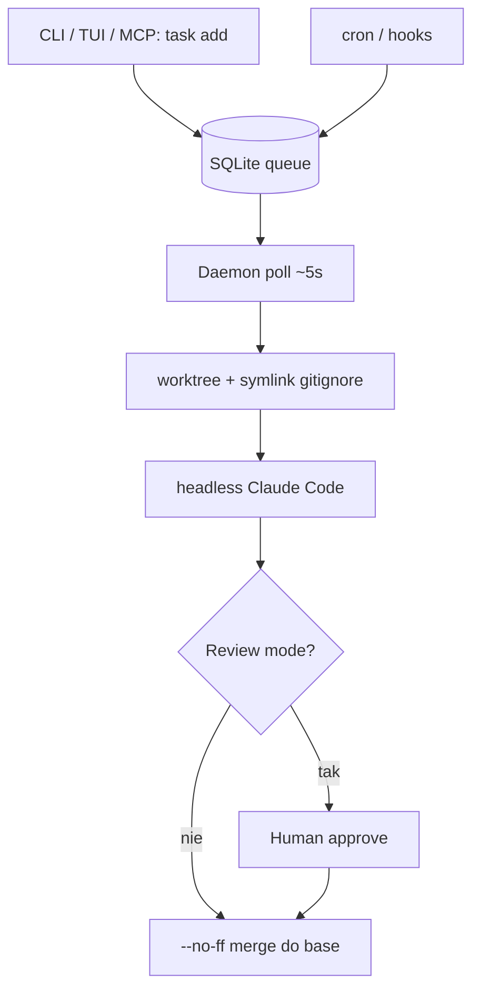

<!-- spine: spine_agent_loop -->
# Junior

**Repo:** [JHostalek/junior](https://github.com/JHostalek/junior) · ★6 · TypeScript (Bun binary) · MIT · brew `jhostalek/tap/junior`

## Co to jest

**Overnight daemon** dla Claude Code: kolejka SQLite, cron, file-hooks, TUI. Każde zadanie w **izolowanym git worktree** (`junior/<slug>-<id>`), headless `claude --dangerously-skip-permissions`, potem auto-merge `--no-ff` (lub review mode przed merge). MCP `junior-mcp` pozwala workerowi dokładać follow-upy / schedule.

## Graf

## Co / gdzie / jak

| Warstwa | Mechanizm |
|---------|-----------|
| **Trigger** | `junior task add`, TUI, MCP, cron NL, file hooks |
| **Stan** | `.junior/` SQLite WAL + logi + worktrees |
| **Role** | Daemon + N workerów (`max_concurrency` 1–16) |
| **Sandbox** | Worktree isolation; pełna autonomia CC (uwaga: skip-permissions) |
| **Testy** | To, co prompt / MCP agent sam odpali |
| **Merge** | Auto merge-back (domyślnie) lub HITL review |
| **Flota** | Parallel worktrees = lokalna flota |

Kształt: lokalny overnight implementer, nie label-GH mill — ticketem jest wpis w kolejce Junior.

## Confidence

**82 / 100** — kompletna architektura daemon+worktree+TUI; ★6 obscure; agresywne uprawnienia = ryzyko operacyjne.

## Linki

- https://github.com/JHostalek/junior
- https://jhostalek.github.io/junior/
- https://github.com/JHostalek/junior-mcp
