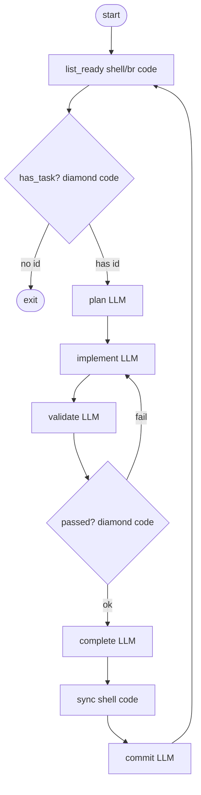

<!-- spine: spine_deterministic -->
# jhugman/attractor-pi-dev (`@jhugman/attractor-pi`)

**spine: deterministic** — `attractor-pi run workflow.dot` / `--simulate`; backend LLM = pi.dev.

**Confidence: 88** — publikowany npm CLI; przykłady issue-loop (Ralph) i spec-to-beads jako **stałe** DOT.

## Co to jest

TS implementacja Attractor na pi-mono. Graf = źródło prawdy; silnik: execute → evaluate edge → checkpoint → repeat.

## Graf (FIXED — `examples/ralph-wiggum/pipeline.dot`)

## LLM vs code

| Węzeł | Typ |
|-------|-----|
| `parallelogram` tool_command / diamond conditions | **code** |
| `prompt=` / `@prompts/*.md` | **LLM** leaf |
| validate CLI / simulate mode | **code** |

## Linki

- https://github.com/jhugman/attractor-pi-dev
- npm: `@jhugman/attractor-pi`
