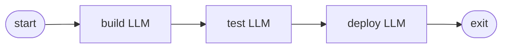

<!-- spine: spine_deterministic -->
# jmccarthy/attractor-c

**spine: deterministic** — pure C11: `./attractor pipeline.dot`; pełny surface nlspec (pipeline + unified LLM + coding loop).

**Confidence: 82** — kompaktowy runner bez frameworkowego „agent orchestruje agentów”; graf = DOT.

## Co to jest

C11 implementacja Attractor. `make` → binarny walker digraphów z promptami, toolami, human gates, parallel.

## Graf (FIXED — README Deploy example)

## LLM vs code

| Element | Typ |
|---------|-----|
| DOT parse + stage dispatch + retries | **code** |
| box `prompt=` | **LLM** leaf |

## Linki

- https://github.com/jmccarthy/attractor-c
