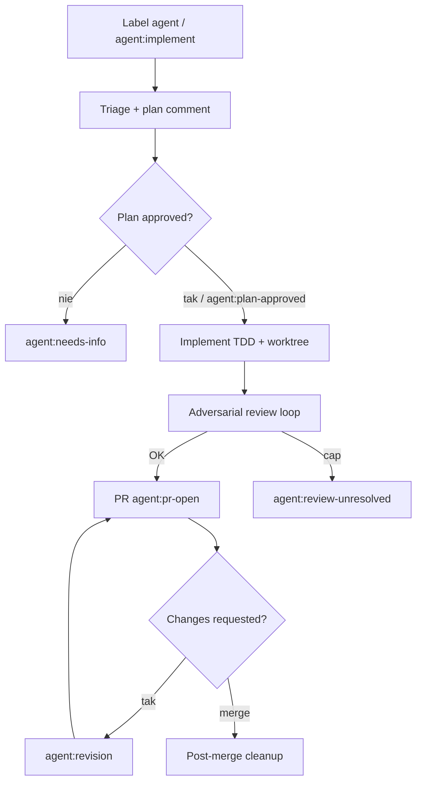

# Sandbox Pal / claude-agent-dispatch (`jnurre64/sandbox-pal-action`)

Reusable **label-driven** dispatch: etykieta `agent` odpala FSM (triage → plan HITL → implement TDD → adversarial review → PR → revision → cleanup). Agent-pipeline na GHA + Claude Code / Codex, bez SaaS.

## Co / gdzie / jak

| Element | Szczegóły |
|--------|-----------|
| **Trigger** | `issues: labeled` — `agent`, `agent:implement`, `agent:plan-approved`, …; revision z review PR |
| **Sandbox** | Self-hosted runner + worktree; bot PAT; skrypty w `.sandbox-pal-dispatch/` (standalone) lub reusable `@v1` |
| **Agent** | Claude Code CLI (domyślnie); named dispatch profiles (Claude/Codex hybrid) |
| **Testy** | `AGENT_TEST_COMMAND` jako gate przed PR; wewnętrzny adversarial review |
| **Merge** | Człowiek — agent otwiera PR i iteruje na `changes requested`; cleanup po merge |

## Confidence: **84 / 100**

Najczystszy „agent-pipeline” w fali E: pełna maszyna stanów etykiet, plan→approve, circuit breaker, concurrency. Obniżka: ★2, self-hosted + bot account jako próg wejścia; nie Marketplace one-click.

## Linki

- Repo: https://github.com/jnurre64/sandbox-pal-action
- Docs: `docs/architecture.md`, `docs/security.md`
- Setup: `/setup` skill lub `./scripts/setup.sh`
