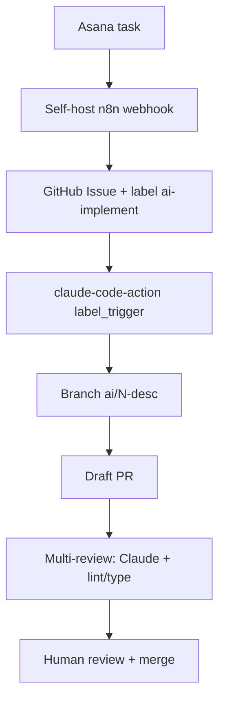

# JP Explaza `ai-implement` — klon label→PR (poza Solvio/JBS)

**Źródło:** [Zenn / エクスプラザ tsucchi](https://zenn.dev/explaza/articles/f4bc2027530ffa) · 2026-03 · Asana→n8n→Issue→claude-code-action→Draft PR

## Co to jest

Japoński klepacz produkcyjny (Explaza): ticket w Asanie → self-host n8n → GitHub Issue z label **`ai-implement`** → `anthropics/claude-code-action@v1` (`label_trigger`) → branch `ai/…` → **Draft PR**. Issue template = spec + pola pomiaru (sukces, czas, rework). Pilot 11/11 Easy+Medium. **Inny** niż Solvio `auto-fix` / JBS `agentic-fix` (już w `jp-label-auto-fix`): tu mostek Asana+n8n + metryki + multi-review na `ai/*`.

## Graf

## Co / gdzie / jak

| Warstwa | Mechanizm |
|---------|-----------|
| **Trigger** | `label_trigger: ai-implement` (auto z n8n) |
| **Stan** | Issue jako rekord pomiaru; komentarze progress z action |
| **Agent** | claude-code-action + `.claude/` conventions |
| **Limity** | `max-turns` 30–100; Easy/Medium OK, Hard = split ticketów |
| **Koszt** | Claude Max OAuth > API key (rate limits); n8n/GHA $0 |
| **Merge** | Człowiek; bottleneck = kolejka Draft PR |

Pokrewne JP (nie osobne karty, ta fala): rariyama `bugfix` label skill; Interpark crash→PR / `claude-fix` Routines — wzorce, nie nowe produkty.

## Confidence

**84 / 100** — pełny artykuł z YAML, wynikami pilotu i kosztami; brak publicznego mono-repo „produktu”, ale dogfood firmowy udokumentowany.

## Linki

- https://zenn.dev/explaza/articles/f4bc2027530ffa
- Kanoniczna karta rodziny: `../jp-label-auto-fix/`
- https://github.com/anthropics/claude-code-action
