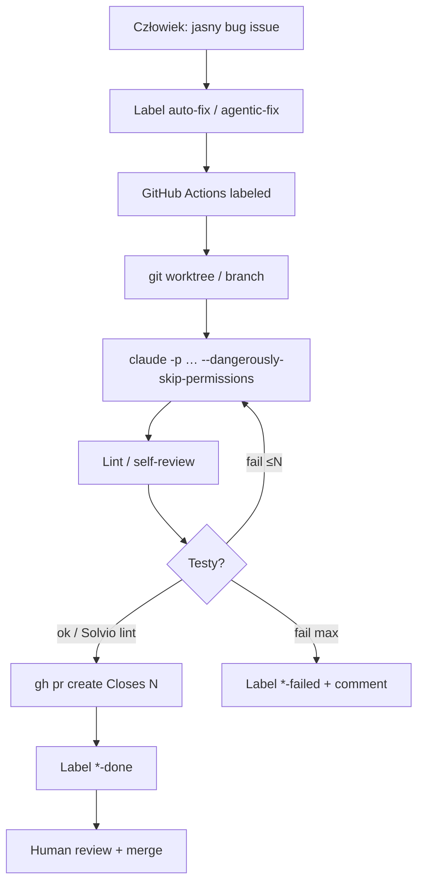

# JP label auto-fix (Claude Code × GHA)

**Confidence: 82** — japońskie DIY klepacze: etykieta → worktree/runner → Claude Code → PR; pełny kod w artykułach; nie produkt SaaS, nie L5.

## Co to jest

Wzór praktyki JP (2026): Issue + label (`auto-fix` / `agentic-fix`) odpala GitHub Actions + Claude Code CLI na self-hosted (lub hosted) runnerze. Maszyna stanów etykietami; draft PR; człowiek merguje. Dwa dobrze opisane warianty: Solvio (`auto-fix`) i JBS Tech Blog (`agentic-fix` + retry testów).

## Graf

## Co / gdzie / jak

| Element | Wartość |
|---------|---------|
| Trigger | `issues: labeled` + `if: label == auto-fix` (Solvio) lub `agentic-fix` (JBS) |
| FSM etykiet | Solvio: `auto-fix` → `in-progress` → `done` / `failed`; JBS: `agentic-fix` / `agentic-fix-failed` |
| Sandbox | Self-hosted runner + `git worktree` (Solvio); Phase Prepare/Fix/Verify/Submit (JBS) |
| Agent | Claude Code CLI headless; `CLAUDE.md` / issue template jako spec |
| Testy | Solvio: lint (`pnpm check:fix`); JBS: test loop max 3 + re-fix max 2 |
| Merge | Zawsze ludzki (zalecenie autorów) |
| Koszt | Self-hosted = $0 Actions minutes; płaci się model |
| Nie robi | Auto-merge; duże feature’y; migracje/security bez holdoutu |

### Warianty

1. **Solvio / sho_ (Zenn 2026-03)** — Node `auto-fix-issue.mjs`, worktree, concurrency per issue, timeout 30m.
2. **JBS Agentic DevOps (2026-07)** — issue template z kategorią/repro/expected; Claude fix + testy + PR body; eskalacja label+comment.

## Linki

- https://zenn.dev/solvio/articles/63842f1417883a
- https://blog.jbs.co.jp/entry/2026/07/24/140419
- Pokrewne kanon: https://github.com/berenddeboer/ready-for-agent
