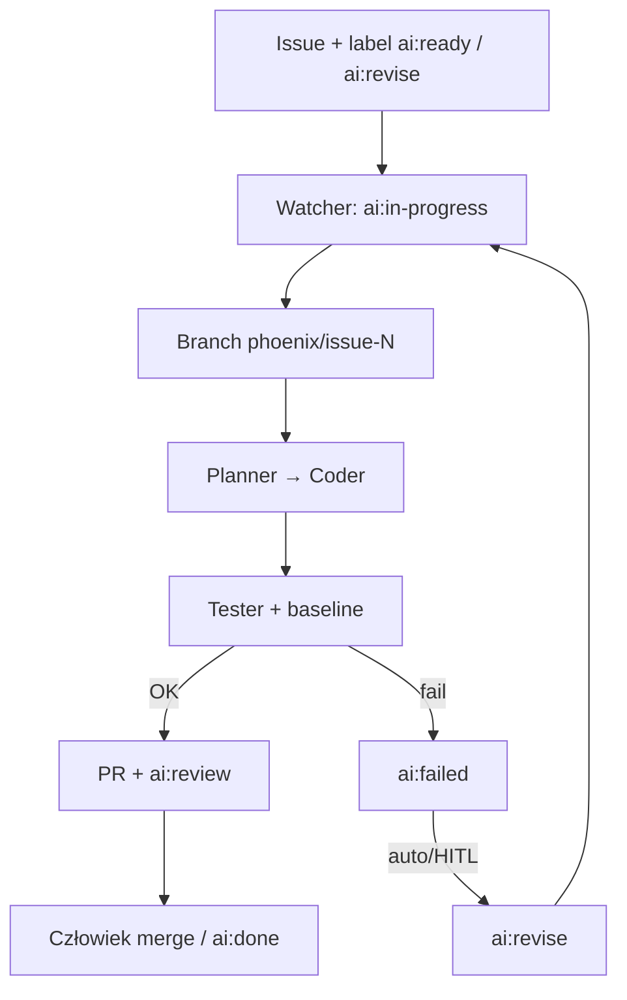

# PhoenixGitHub (`kkipngenokoech/phoenix`)

Watcher + wieloagentowy pipeline LLM, który bierze issue z etykietą `ai:ready` (lub `ai:revise`), przechodzi plan → kod → testy → PR i synchronizuje stan przez etykiety GitHub. To klasyczny klepacz ticket→PR, nie fabryka całego produktu.

## Co / gdzie / jak

| Element | Szczegóły |
|--------|-----------|
| **Trigger** | Etykieta `ai:ready` lub `ai:revise` (daemon `phoenixgithub watch` albo one-shot `run-issue`) |
| **Sandbox** | Lokalny host / worktree na branchu `phoenix/issue-<nr>`; brak osobnego cloud sandbox w core |
| **Agent** | Multi-agent: Planner, Coder, Tester, Failure Analyst, PR Agent (LLM przez `LLM_PROVIDER` / `LLM_MODEL`) |
| **Testy** | `TEST_COMMAND` + porównanie z baseline; profile `auto` / `python` / `frontend` / `generic`; pętla `AUTO_REVISE_*` |
| **Merge** | Tylko człowiek — sukces kończy się na `ai:review` + PR; `ai:done` po akceptacji |

## Confidence: **78 / 100**

Czysty label-state-machine klepacz z czytelnym README, CLI i rolami agentów. Obniżka: mało gwiazdek (~1), brak marketplace Action (to watcher lokalny, nie GHA-first), starsza aktywność (aktualizacja ~kwi 2026). Mechanizm jest jednak konkretny i wąski — dokładnie ticket→PR.

## Linki

- Repo: https://github.com/kkipngenokoech/phoenix
- Pakiet: `pip install phoenixgithub` → `phoenixgithub init` / `watch`
- Workflowy w repo: tylko `publish-pypi.yml` (dystrybucja; pętla żyje w CLI, nie w Actions)
