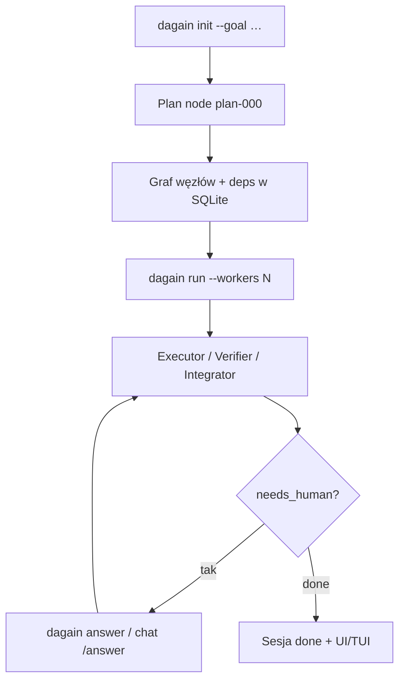

<!-- spine: spine_deterministic -->
# dagain (`knot0-com/dagain`)

CLI: **DAG work graph** w SQLite — planer / executor / verifier / integrator jako węzły z runnerami Codex, Claude Code lub Gemini. Cel (`--goal`) → graf → równolegli workers (+ opcjonalne worktrees) → checkpoint `needs_human`.

## Co / gdzie / jak

| Element | Szczegóły |
|--------|-----------|
| **Trigger** | Lokalnie: `dagain init --goal` + `dagain run`; nie GHA label (chyba że owiniesz) |
| **Sandbox** | `.dagain/sessions/…`; `supervisor.worktrees.mode=always` dla konfliktogennych editów |
| **Agent** | Konfigurowalne runners w `.dagain/config.json` (codex/claude/gemini + role) |
| **Testy** | Węzeł verifier / `shellVerify`; fresh context z grafu, nie długi transcript |
| **Merge** | Integrator w grafie; PR zależy od goal/prompt — nie wbudowany `issues: labeled` |

## Confidence: **70 / 100**

Silny wzorzec DAG+SQLite (świeży kontekst, parallel, HITL timeout). Obniżka: ★10, goal-driven a nie ticket-queue; klepacz issue wymaga mostu (gh issue → goal).

## Linki

- Repo: https://github.com/knot0-com/dagain
- Docs: https://knot0.com/writing/dagain
- npm: `npx dagain` / `npm i -g dagain`
