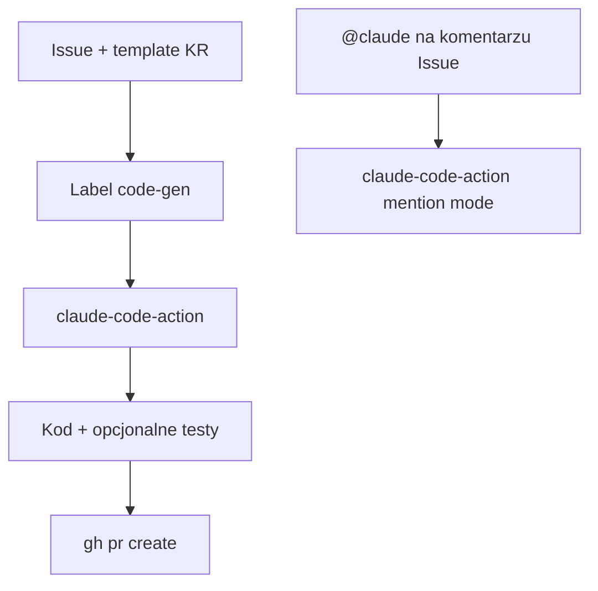

<!-- spine: spine_deterministic -->
# Leesumok/plug-and-play-actions — Korea DIY

**Repo:** [Leesumok/plug-and-play-actions](https://github.com/Leesumok/plug-and-play-actions) · ★0 · szablon GHA · autor Leesumok (KR)

## Co to jest

Koreański szablon „fork + secrets”: dwa workflow na `anthropics/claude-code-action@v1` — (1) `@claude` na Issue comment, (2) label **`code-gen`** → analiza Issue → kod/testy → branch → PR. Feature Request template (목표 / 상세 / 기술 / 브랜치). Cienki, ale realny ticket→PR; nie SaaS.

## Graf

## Co / gdzie / jak

| Warstwa | Mechanizm |
|---------|-----------|
| **Trigger** | Label `code-gen` lub `trigger_phrase` w komentarzu |
| **Stan** | Brak bogatego FSM — jednorazowy run GHA |
| **Sandbox** | Hosted GitHub Actions runner |
| **Merge** | Człowiek (brak auto-merge w szablonie) |

Pokrewne KR (odrzucone jako osobne karty): gideokkim blog (DIY triage+@claude, nie produkt); HakjunMIN/SWE-agent = fork akademickiego SWE-agent, nie oryginalny mill; HakjunMIN github-mcp `assign_…_to_issue` = glue do SWE-agent.

## Confidence

**58 / 100** — kod szablonu istnieje; ★0, brak dogfood metryk; uczciwy „KR DIY clone”, nie vapor marketingowy.

## Linki

- https://github.com/Leesumok/plug-and-play-actions
- Kontekst KR DIY: https://gideokkim.github.io/claude/github-issue-pr-automation/
