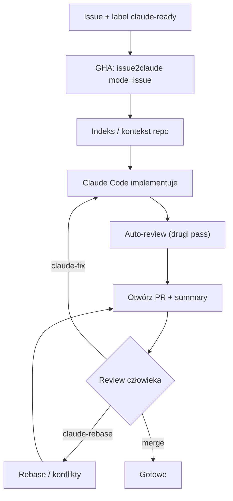

<!-- spine: spine_deterministic -->
# Issue2Claude (`lennystepn-hue/issue2claude`)

GitHub Action / Marketplace: dodajesz etykietę `claude-ready` na issue, Claude Code analizuje repo, implementuje, robi auto-review i otwiera PR. Komentarze `claude-fix` / `claude-retry` / `claude-rebase` domykają pętlę feedbacku — czysty klepacz label→PR.

## Co / gdzie / jak

| Element | Szczegóły |
|--------|-----------|
| **Trigger** | `issues: labeled` gdy `claude-ready`; retry przez komentarz `claude-retry`; slash `/claude …` |
| **Sandbox** | Runner GitHub Actions (`ubuntu-latest`) + checkout; Claude Code na runnerze |
| **Agent** | Claude Code (`@anthropic-ai/claude-code`); auth: API key lub `CLAUDE_CODE_OAUTH_TOKEN`; opcjonalnie embeddingi OpenAI do indeksu |
| **Testy** | Zależą od promptu / repo (agent ma uruchamiać testy w trakcie); brak osobnego gate'a w action poza auto-review |
| **Merge** | Człowiek — action tworzy PR; `claude-fix` iteruje na tym samym branchu |

## Confidence: **82 / 100**

Bardzo czytelny produkt Marketplace z jednym triggerem etykiety i pełnym loopem (fix/rebase/chain `depends-on`). Obniżka: niski social proof (~1★), warstwa to wrapper wokół Claude Code Action (nie własny orchestrator), jakość zależy od promptu i uprawnień Actions do tworzenia PR.

## Linki

- Repo: https://github.com/lennystepn-hue/issue2claude
- Marketplace: https://github.com/marketplace/actions/issue2claude
- Przykład workflow dogfood: https://github.com/lennystepn-hue/ghostclip/blob/main/.github/workflows/issue2claude.yml
- Setup: `npx issue2claude`
