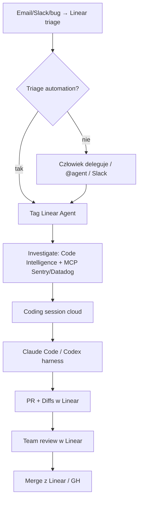

# Linear Agent — coding sessions

**Confidence: 87** — tracker-native ticket→PR; triage automation zdejmuje limbo assign; merge nadal ludzki (z Diffs w Linear).

## Co to jest

Sesje kodujące wewnątrz Linear: issue → Agent (Claude Code / Codex w chmurze) → PR + Diffs. Kontekst issue/dyskusji/klienta/Code Intelligence bez przepisywania promptu. Triage może otagować agenta od razu.

## Graf

## Co / gdzie / jak

| Element | Wartość |
|---------|---------|
| Trigger | Assign do Linear Agent; comment/chat/Slack; triage automation |
| Sandbox | Cloud harness (Claude Code / Codex); GitHub code access |
| Kontekst | Issue + discussion + customer requests + Code Intelligence + MCP |
| Review | Diffs (structural + AI-guided) obok issue |
| Merge | Człowiek (z Linear lub GitHub) |
| Claim (vendor) | Linear: ~700 PR/mies. agentem; wcześniej ~30% bugów first-pass; Ramp Inspect >60% merge przez Linear API |
| Plany | Basic/Business/Enterprise + AI credits; admin controls |
| Nie robi | Lights-out bank bez review; wybór strategii produktu |

## Linki

- https://linear.app/now/coding-sessions-for-linear-agent (2026-06-11)
- https://linear.app/changelog/2026-06-11-coding-sessions
- https://linear.app/
