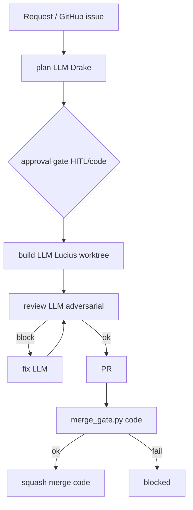

<!-- spine: spine_deterministic -->
# luminik-io/alfred

**spine: deterministic** — stała sekwencja `plan → approve → build → review → fix → ship` w Pythonie; `lib/merge_gate.py` = jeden predykat (nie persona).

**Confidence: 80** — nie DOT/GHA-compile jak gp-foundry, ale orkiestracja = kod + policy YAML/env; Claude/Codex/OpenCode tylko w slotach ról.

## Co to jest

Autonomiczny zespół inżynierski (worktree, label roles, demo orchestrator). Merge tylko gdy GitHub native state przejdzie hard gate (fail-closed, SHA-guarded squash).

## Graf (FIXED — demo / fleet stages)

## LLM vs code

| Element | Typ |
|---------|-----|
| Stage machine / preflight / claim issue | **code** |
| `lib/merge_gate.py` | **code** (policy) |
| plan / build / review / fix roles | **LLM** leaf |
| Engine routing Claude↔Codex | **code** |

## Linki

- https://github.com/luminik-io/alfred
- Merge gate: https://github.com/luminik-io/alfred/blob/main/docs/MERGE_GATE.md
