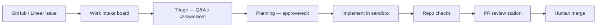

<!-- spine: spine_hybrid -->
# mastra softwarefactory-template

**Repo:** [mastra-ai/softwarefactory-template](https://github.com/mastra-ai/softwarefactory-template) · ★39 · TypeScript · Mastra Factory

## Co to jest

Open-source Software Factory na [Mastra](https://mastra.ai): web UI + serwer, intake z GitHub Issues / Linear, staged gates (intake → triage → planning → building → review → completion), sandbox (platform lub local), output = PR. Ludzie odpowiadają w triage/plan i mergują; agent klepie między bramkami.

## Graf

## Co / gdzie / jak

| Warstwa | Mechanizm |
|---------|-----------|
| **Trigger** | Sync issues → Intake → „Investigate” / start session |
| **Stan** | Factory server + DB (Postgres/pgvector); per-work-item session |
| **Role** | Staged automation (nie jeden god-agent); opcjonalny `/goal` mode |
| **Sandbox** | Mastra platform sandboxes lub `FACTORY_SANDBOX_PROVIDER=local` |
| **Creds** | GitHub App; encrypted credential key |
| **Merge** | Człowiek w Review — factory nie zastępuje judgment |
| **Slack** | Opcjonalny start sesji z Slacka |

Klepacz z UI: ticket → bramki → PR. Wyżej „produktowo” niż robotsix (dashboard), niżej dogfood-obscurity.

## Confidence

**70 / 100** — realny template + docs factory.mastra.ai; część ścieżek pcha Mastra platform (opcjonalnie `--no-platform`); nie low-vapor, ale nie solo-mill.

## Linki

- https://github.com/mastra-ai/softwarefactory-template
- https://mastra.ai/factory
- https://factory.mastra.ai/
