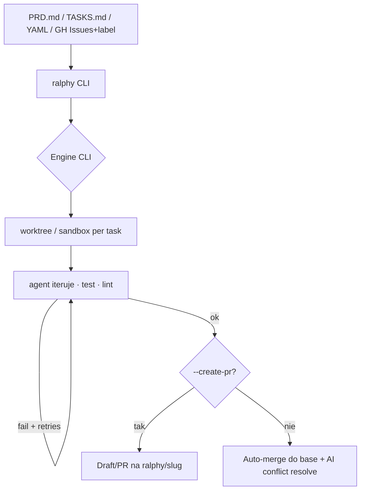

# Ralphy

**Repo:** [michaelshimeles/ralphy](https://github.com/michaelshimeles/ralphy) · ★2969 · TypeScript (+ bash) · npm `ralphy-cli` · MIT-like (brak SPDX w API)

## Co to jest

Lokalny **Ralph Wiggum loop**: CLI owija Claude Code / Codex / OpenCode / Cursor / Qwen / Droid / Copilot / Gemini i klepie kolejkę zadań do skutku. Źródło pracy: prompt, `PRD.md` / `TASKS.md`, YAML/JSON albo **GitHub Issues + etykieta** (`--github-label`). Tryb `--parallel` = flota worktree; `--create-pr` / `--draft-pr` = gałęzie zamiast auto-merge.

## Graf

## Co / gdzie / jak

| Warstwa | Mechanizm |
|---------|-----------|
| **Trigger** | CLI: prompt, `--prd`, `--github owner/repo --github-label ready` |
| **Stan** | `.ralphy/config.yaml`, progress; PRD na dysku = kolejka |
| **Role** | Jedna pętla agentowa (bez osobnego reviewera w starterze) |
| **Sandbox** | Git worktree (domyślnie) lub `--sandbox` (symlink deps) |
| **Testy** | `commands.test/lint` z config; `--fast` wyłącza |
| **Merge** | Domyślnie auto-merge; klepacz-PR = `--branch-per-task --create-pr` |
| **Flota** | `--parallel --max-parallel N` |

Najbliższy „local overnight / worktree fleet” z etykietą GH → PR w tej fali.

## Confidence

**92 / 100** — żywy produkt (npm, ★~3k), jawny label→issue→worktree→PR; auto-merge domyślny = trzeba świadomie przełączyć na draft PR (polityka Off).

## Linki

- https://github.com/michaelshimeles/ralphy
- https://www.npmjs.com/package/ralphy-cli
- https://ralphy.goshen.fyi
